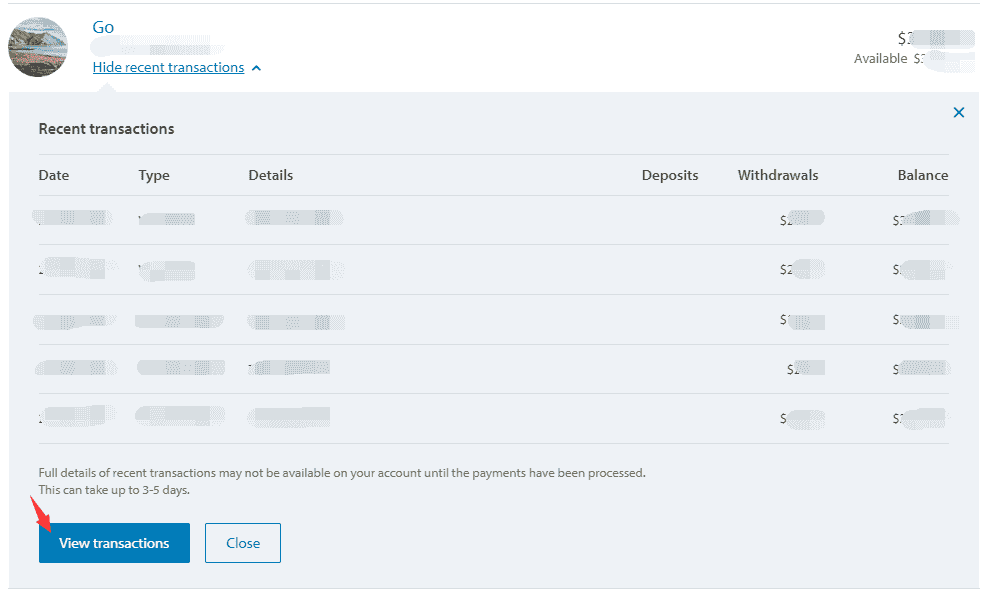
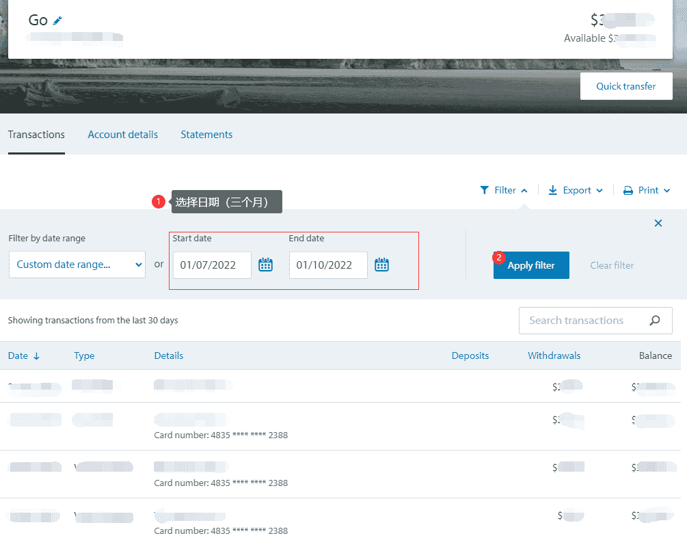
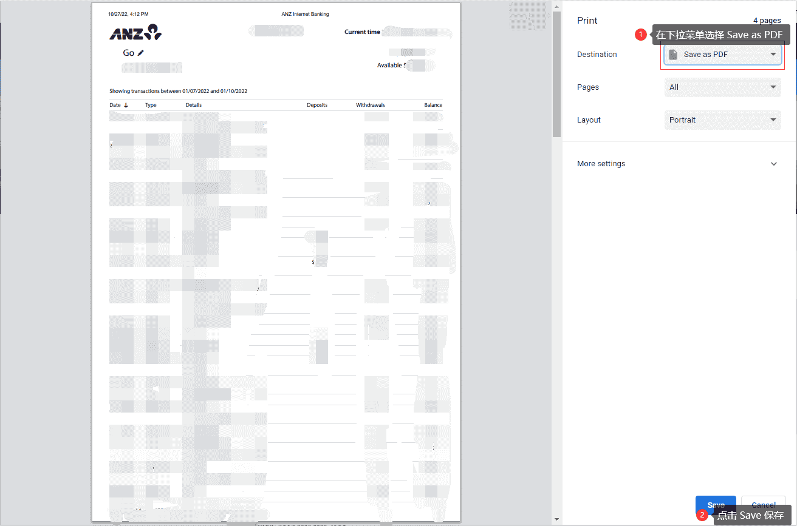

# ANZ 电子银行流水

在新西兰，ANZ 银行客户可通过 **ANZ Internet Banking** 或 **goMoney** App 获取电子银行流水，用于签证、租房等场景。

::: info
ANZ 网上银行和 goMoney 中的 **Document**（文档）区域可下载各类证明，如 Withholding Tax Certificate 等。流水与交易记录可通过账户详情页获取。
:::

## 办理渠道

- **ANZ Internet Banking**：电脑端登录 [anz.co.nz](https://www.anz.co.nz/personal/accounts/online-banking/)
- **goMoney**：手机 App

## 获取步骤

### 1. 登录 ANZ Internet Banking

使用你的 ANZ 网上银行账号和密码登录。

### 2. 进入「Your accounts」（你的账户）

登录后默认进入账户概览页，可看到所有当前账户和储蓄账户。

### 3. 展开并查看交易记录

在每个账户下方，点击 **「View recent transactions」**（查看最近交易）展开交易明细弹窗。弹窗会显示近期交易摘要，底部有 **「View transactions」** 按钮，点击可进入完整交易列表页面。

::: tip
弹窗底部提示：完整交易明细可能在款项处理完成后 3～5 个工作日才能查看。
:::

### 4. 筛选日期并导出

进入交易详情页后，可进行以下操作：

- **Filter by date range**：选择「Custom date range」自定义起止日期（如签证要求的 3 个月流水）
- **Apply filter**：应用筛选后显示该时间段内的交易
- **Export / Print**：通过顶部的 Export 或 Print 功能导出流水

### 5. 保存为 PDF

若选择 **Print** 导出，按 **`Cmd+P`**（Mac）或 **`Ctrl+P`**（Windows）打开浏览器打印对话框，然后：

1. 在 **Destination**（目标）下拉菜单中选择 **「Save as PDF」**
2. 点击 **「Save」** 保存为 PDF 文件

## 注意事项

- 电子流水建议保存为 PDF，便于打印或在线提交
- 如需银行盖章原件，可前往 ANZ 网点申请打印并盖章
- 若需覆盖较长周期（如 6 个月以上），建议提前在网银中确认可导出时间范围

## 相关链接

- [ANZ 网上银行](https://www.anz.co.nz/personal/)

---
*最后编辑：待补充* · 作者：[Bald-M](https://github.com/Bald-M)
