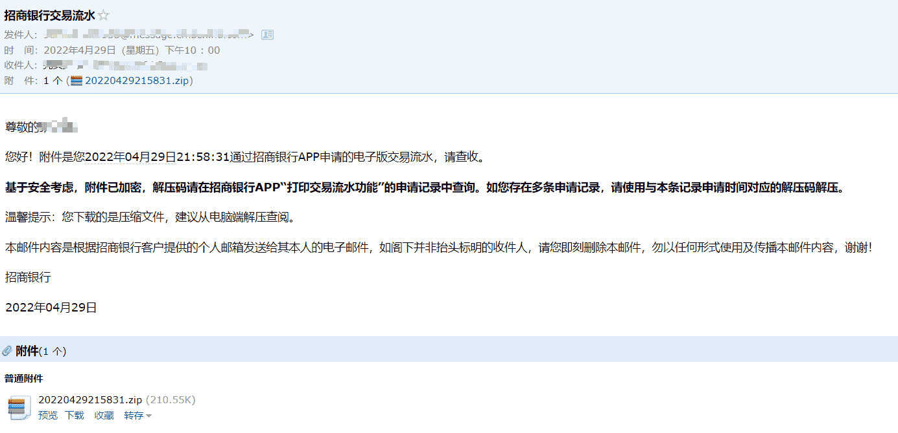

# 招商银行电子流水

招商银行（CMB）客户可通过 **招商银行 App** 申请电子交易流水，用于签证、留学、贷款等场景。电子流水将发送至指定邮箱。

::: tip 中英文版本
招商银行流水支持 **中文和英文** 两种版本，申请时可按需选择。若签证或海外机构要求英文材料，可直接申请英文版流水，**无需另行翻译**，省去翻译时间和费用。
:::

## 办理渠道

- **招商银行 App**（手机端）

## 获取步骤

### 1. 打开招商银行 App 并搜索

在 App 首页搜索栏输入 **「流水打印」**，进入流水打印功能。

### 2. 填写申请信息

在流水打印页面进行配置：

| 项目 | 说明 |
|------|------|
| **卡号** | 选择需要打印流水的银行卡 |
| **起始日期 / 结束日期** | 选择流水的时间范围 |
| **展示摘要类型** | 可选「全部」等 |
| **展示交易对手信息** | 建议开启，便于审核方核对 |
| **展示完整卡号** | 按受理方要求选择 |
| **展示收入及支出汇总金额** | 建议开启 |
| **交易币种** | 可选「全部」或指定币种 |
| **交易类型** | 全部 / 收入类 / 支出类 |
| **接收邮箱** | 填写接收流水的邮箱地址 |

::: warning QQ 邮箱提示
QQ 邮箱可能会被拦截，若未收到邮件，建议联系 QQ 客服或改用其他邮箱（如网易、Gmail 等）。
:::

填写完成后，点击 **「同意协议并提交」** 完成申请。

### 3. 查收邮件并解压

银行会将流水以 **加密压缩包**（.zip）形式发送至你填写的邮箱。

1. 查收主题为 **「招商银行交易流水」** 的邮件
2. 下载附件 .zip 文件
3. **解压密码**：在招商银行 App → 「流水打印」→ 「申请记录」中查看该次申请对应的解压码
4. 若有多条申请记录，请使用与本次申请时间对应的解压码
5. 建议在电脑端解压后查阅

## 注意事项

- 流水数据有更新延时，申请页会显示「交易流水数据更新截止至」日期，请注意时效
- 申请前确认受理方对流水语言（中/英）、时间范围、格式的要求
- 英文版流水直接由银行出具，无需公证或翻译，符合大多数签证及海外机构要求

## 相关链接

- [招商银行官网](https://www.cmbchina.com/)

---
*最后编辑：待补充* · 作者：[Bald-M](https://github.com/Bald-M)
