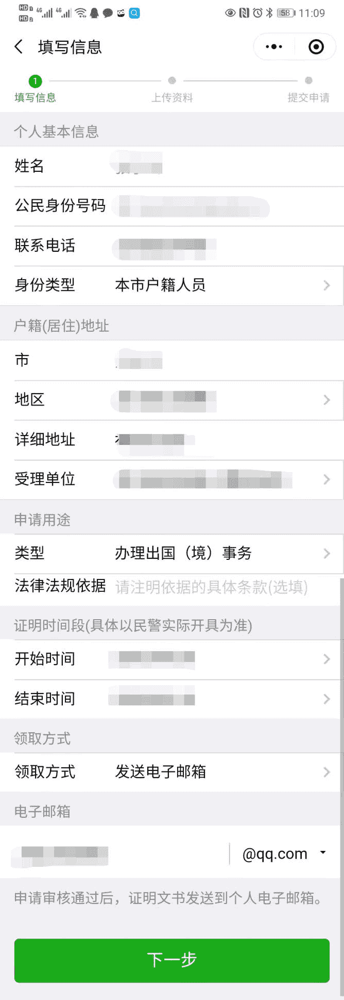

# 广东省 · 无犯罪记录证明

广东省居民可通过「粤省事」小程序在线申请无犯罪记录证明，无需现场办理。

::: tip
以下信息供参考，具体以粤省事最新流程为准。
:::

## 办理渠道

**粤省事** 小程序 / App

- 微信搜索「粤省事」或通过广东省政务服务网入口进入

## 申请前准备

- **本人有效身份证**
- **本人实名认证手机号**（需与粤省事账号一致）
- **申请事由**（如：出国签证、就业等）
- **领取方式**：自取或邮寄

## 办理步骤

1. **登录粤省事**
   - 打开粤省事小程序，完成实名认证登录

2. **进入办理入口**
   - 首页搜索「无犯罪记录」
   - 或进入「户政（治安）」→「无犯罪记录证明」

   

3. **填写申请信息**
   - 选择申请用途（如「办理出国（境）事务」）
   - 填写户籍地址、现居住地址等
   - 选择领取方式（电子邮件）

    

4. **上传资料**
   - 上传身份证正反面照片
   - 申请用途证明材料（一年内申请3次以上需上传）

   

5. **提交审核**
   - 提交后等待公安机关审核
   - 一般 1～3 个工作日可办结

5. **领取证明**
   - **邮件**：邮箱搜索“无犯罪记录证明书”

   

## 注意事项

- 非户籍人员如在广东办理，需满足当地规定的居住或就业条件，具体以粤省事提示为准
- 证明有效期因用途而异，签证用一般 3～6 个月有效，建议临近办理签证前再申请
- 若提示无法线上办理，可致电当地公安或前往线下窗口咨询

---
*最后编辑：2021-12-22*
