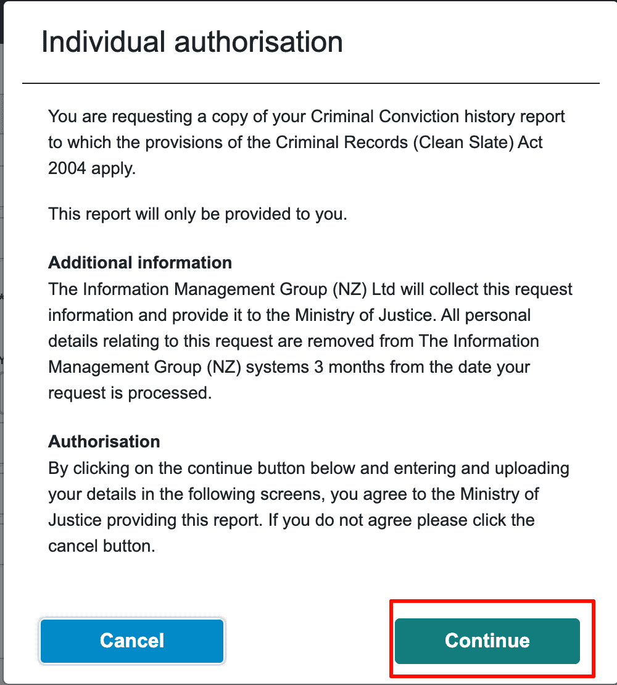
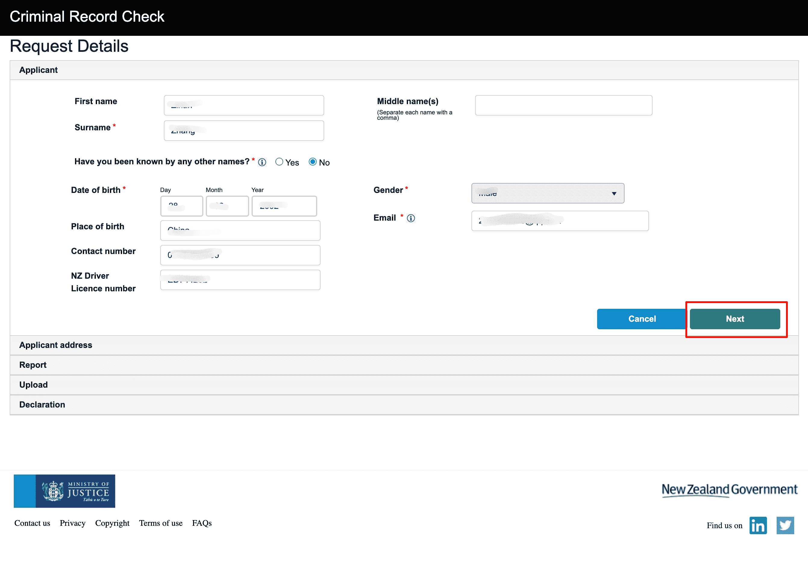
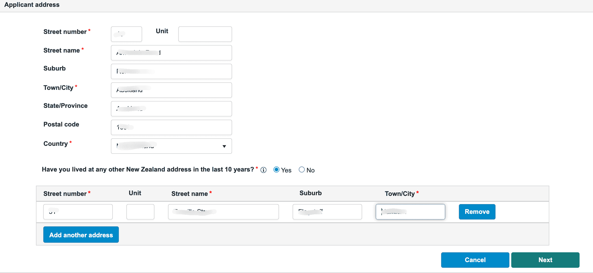
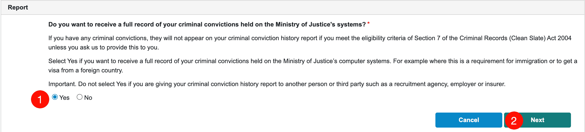
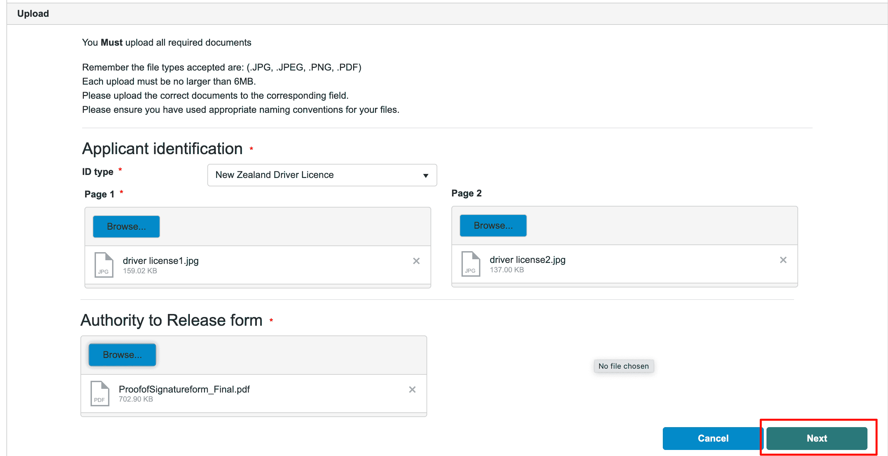
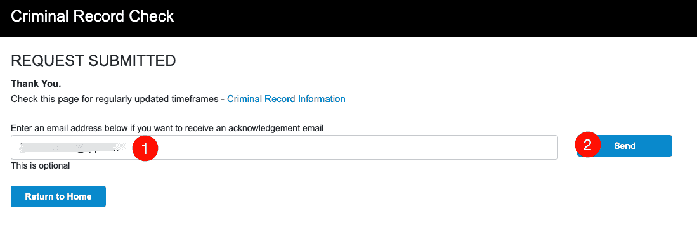
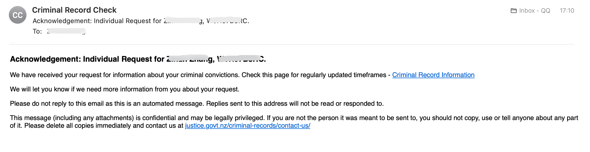

# 奥克兰 · 无犯罪记录证明

新西兰无犯罪记录证明（Criminal Conviction History / Police Clearance）由司法部（Ministry of Justice）统一办理，奥克兰居民通过线上申请即可，无需到场。

::: tip
以下流程基于新西兰司法部官网（justice.govt.nz），信息供参考，请以官网最新说明为准。
:::

## 办理渠道

**新西兰司法部官网** · https://www.justice.govt.nz/

- 支持在线申请，全国通用，奥克兰居民同样通过该渠道办理

## 申请前准备

在开始申请前，请准备好以下材料：

| 材料 | 说明 |
|------|------|
| **有效身份证件** | 护照或驾照等带照片和签名的证件 |
| **Authority to Release Information 表格** | 需本人签字并填写日期，[从官网下载 PDF](https://www.criminalrecords.govt.nz/forms/ProofofSignatureform_Final.pdf) |

::: warning 表格填写要求
- 证件上必须有本人签名
- 表格上的签名须与证件上的签名一致
- 须填写正确的签字日期
:::

**文件格式要求**：支持 .JPG、.JPEG、.PNG、.PDF，单个文件不超过 6MB。若保存为 PDF，建议使用 Adobe Acrobat 以保证兼容性。

## 办理步骤

### 1. 进入申请入口

方式一：打开 [justice.govt.nz](https://www.justice.govt.nz/)，在顶部导航或 Quick links 中点击 **Criminal record check**。

方式二：在官网搜索框中输入 **criminal record check**，在结果页选择 **Get your own criminal record**（申请本人无犯罪记录）。

### 2. 准备材料并下载表格

在 **Get your own criminal record** 页面，确认所需材料：

- 有效身份证件
- 已签字、填日期的 Authority to Release Information Form

点击 **Apply online** 进入在线申请系统。

### 3. 选择申请类型

进入 Criminal Record Check 在线服务后，会看到两个选项：

- **Registered Third Party**：代表他人申请（需已注册的机构账号）
- **Individual Request**：申请本人的无犯罪记录

申请本人记录时，点击 **Individual Request**。

### 4. 确认材料并创建申请

在 **Criminal Record Check** 页面确认已准备好：

- 有效身份证件
- 已签字、填日期的 Authority to Release Form

勾选「I have the documents needed, and ready to begin my request」，完成 reCAPTCHA 验证，点击 **Create Request**。

### 5. 授权同意

阅读 **Individual authorisation** 页面说明（信息将由 Information Management Group 收集并提交司法部，个人数据 3 个月后从系统中移除）。同意后点击 **Continue**。

### 6. 填写申请人信息

在 **Request Details** 页填写：

- 姓名（First name、Surname、Middle name）
- 是否曾用其他姓名
- 出生日期、性别、出生地
- 邮箱、联系电话
- 新西兰驾照号（如使用驾照作为证件）

填写完成后点击 **Next**。

### 7. 填写地址

在 **Applicant address** 页填写：

- 当前住址（街道号、街道名、 suburb、城市、邮编、国家等）
- 过去 10 年是否在新西兰有其他住址（如有需逐一添加）

填写完成后点击 **Next**。

### 8. 选择报告类型

在 **Report** 页选择是否需要完整犯罪记录：

- **Yes**：获取司法部系统中的完整定罪记录（**签证用途请选 Yes**，如移民、境外签证等）
- **No**：不获取完整记录（适用于交给雇主、招聘机构、保险公司等第三方时）

::: tip 签证用途
若用于移民或境外签证，请选择 **Yes**；若交给雇主、中介等第三方，请选择 **No**。
:::

### 9. 上传材料

在 **Upload** 页上传：

- **Applicant identification**：身份证件（如新西兰驾照需上传 Page 1 和 Page 2，护照需上传个人信息页）
- **Authority to Release form**：已签字、填日期的 Authority to Release Information 表格 PDF

支持 .JPG、.JPEG、.PNG、.PDF，单文件不超过 6MB。上传完成后点击 **Next**。

::: tip Authority to Release 表格
填写表格时请确保：证件上有本人签名；表格签名与证件一致；签字日期正确。详见 [官网 PDF](https://www.criminalrecords.govt.nz/forms/ProofofSignatureform_Final.pdf)。
:::

### 10. 声明并提交

阅读 **Declaration** 内容，确认信息真实，完成声明后提交申请。

### 11. 提交成功

提交后会显示 **REQUEST SUBMITTED**。可选填邮箱接收确认邮件，或点击 **Return to Home** 返回首页。

### 12. 查收确认邮件

申请受理后，会收到 **Acknowledgement** 邮件，确认已收到你的请求。可点击邮件中的链接查看处理进度与预计时间。

## 相关链接

- **新西兰司法部官网**：https://www.justice.govt.nz/
- **Criminal record check 专题页**：https://www.justice.govt.nz/criminal-records/
- **咨询邮箱**：CCHonline@justice.govt.nz

## 注意事项

- 申请本人记录为 **Individual Request**，申请他人记录需通过 **Registered Third Party**
- 证明有效期因用途而异，签证用一般 3～6 个月有效，建议临近办理签证前再申请
- 若有疑问，可发邮件至 CCHonline@justice.govt.nz 或参考官网 Contact us 页面

---
*最后编辑：2026-03-15* · 作者：[Bald-M](https://github.com/Bald-M)
