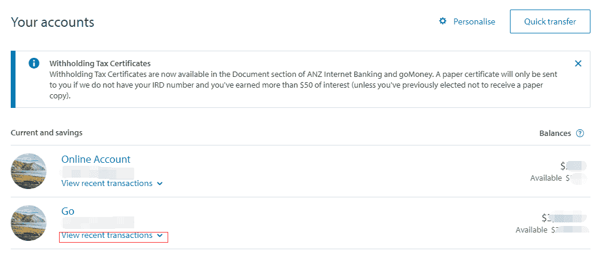

# ANZ Electronic Bank Statements

In New Zealand, ANZ customers can obtain electronic bank statements through **ANZ Internet Banking** or the **goMoney** App for visas, rentals, and similar scenarios.

::: info
The **Document** area in ANZ Internet Banking and goMoney can be used to download various certificates, such as Withholding Tax Certificates. Statements and transaction records can be obtained from the account details page.
:::

## Channels

- **ANZ Internet Banking**: log in on desktop at [anz.co.nz](https://www.anz.co.nz/personal/accounts/online-banking/)
- **goMoney**: mobile app

## Steps

### 1. Log in to ANZ Internet Banking

Log in with your ANZ Internet Banking username and password.

### 2. Go to "Your accounts"

After logging in, you will land on the account overview page by default, where you can see all current and savings accounts.

### 3. Expand and view transaction records

Under each account, click **"View recent transactions"** to expand the recent transaction pop-up. The pop-up shows a recent transaction summary. At the bottom, click **"View transactions"** to open the full transaction list page.

::: tip
The message at the bottom of the pop-up says that full transaction details may only be available 3-5 working days after the payment has been processed.
:::

### 4. Filter by date and export

On the transaction details page, you can:

- **Filter by date range**: choose "Custom date range" and set the start and end dates, such as the 3-month statement period required for a visa
- **Apply filter**: show transactions within the selected period
- **Export / Print**: use the Export or Print function at the top to export the statement

### 5. Save as PDF

If you choose **Print**, press **`Cmd+P`** on Mac or **`Ctrl+P`** on Windows to open the browser print dialog, then:

1. Select **"Save as PDF"** from the **Destination** dropdown
2. Click **"Save"** to save the PDF file

## Notes

- It is recommended to save electronic statements as PDFs for printing or online submission.
- If you need a bank-stamped original, visit an ANZ branch to request printing and stamping.
- If you need a longer period, such as more than 6 months, confirm the exportable date range in Internet Banking in advance.

## Related Links

- [ANZ Internet Banking](https://www.anz.co.nz/personal/)

---
*Last edited: to be added* · Author: [Bald-M](https://github.com/Bald-M)
