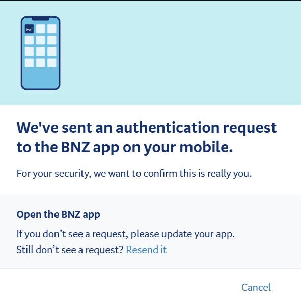
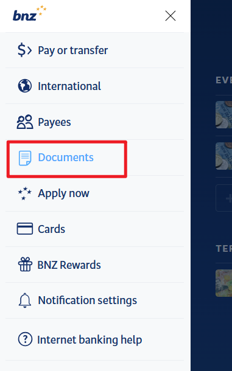
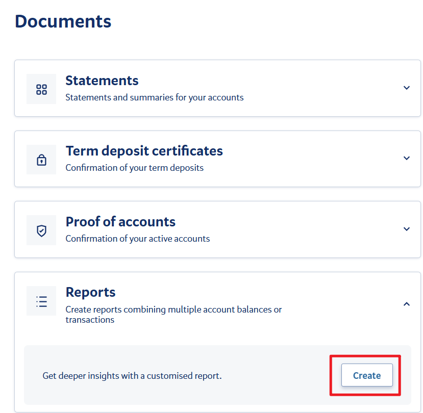

# BNZ Electronic Bank Statements

In New Zealand, BNZ customers can obtain electronic bank statements through the [BNZ website](https://www.bnz.co.nz/) or the **BNZ** App for visa applications, rentals, and similar scenarios.

::: info
The **Document** area in BNZ Internet Banking and the app can be used to download various certificates.
:::

## Channels

- **BNZ Internet Banking**: log in on desktop at [bnz.co.nz](https://www.bnz.co.nz/)
- **BNZ**: mobile app

## Steps

### 1. Log in to BNZ Internet Banking

Log in with your BNZ Access Number (found in the email you received when registering your BNZ account) and password. You may need to verify the login through the BNZ App on your phone.

### 2. Find the Document menu after logging in

After logging in, you will land on the account overview page by default, where you can see all current and savings accounts. Click the collapsible menu in the top-left corner and go to the "Document" menu.

### 3. Download Proof

First select **"Proof of accounts"** to download proof for the required account.

::: tip
Note: BNZ Statements show the account but not the account holder's name, so they need to be used together with Proof.
:::

### 4. Download Statement

On the Document page, select the "Reports" option and click "Create" to proceed through the next steps.

Select the account for which you need to generate a statement.

Set the Report type to Statement, choose PDF as the File Format, set the date range as needed, and download it.

## Notes

- It is recommended to save electronic statements as PDFs. Visa applications usually require documents in PDF format.
- It is recommended to use a PDF editing tool, such as Acrobat, to combine the Proof and Statement into one document.

------

*Last edited: 2026-03-25      Author: [wrx012](https://github.com/wrx012)*
