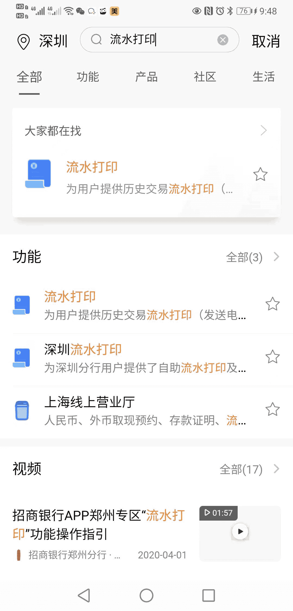
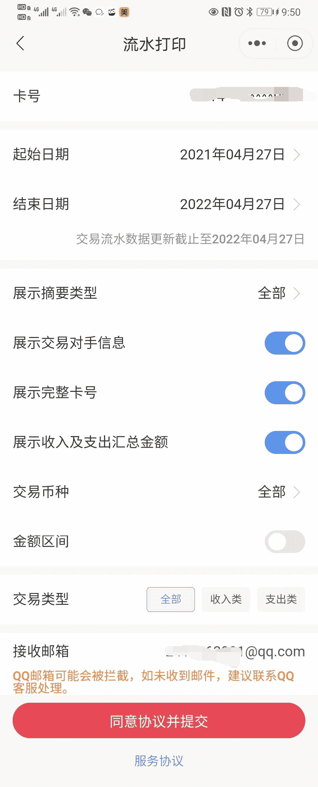

# China Merchants Bank Electronic Statements

China Merchants Bank (CMB) customers can apply for electronic transaction statements through the **China Merchants Bank App** for visas, overseas study, loans, and similar scenarios. The electronic statement will be sent to the specified email address.

::: tip Chinese and English versions
China Merchants Bank statements support both **Chinese and English** versions. You can choose as needed when applying. If a visa office or overseas organization requires English materials, you can apply directly for the English statement, with **no separate translation required**, saving translation time and cost.
:::

## Channel

- **China Merchants Bank App** (mobile)

## Steps

### 1. Open the China Merchants Bank App and search

On the app homepage, enter **"流水打印"** in the search bar and open the statement printing function.

### 2. Fill in application information

Configure the statement printing page:

| Item | Description |
|------|-------------|
| **Card number** | Select the bank card for which you need to print statements |
| **Start date / End date** | Select the statement date range |
| **Summary display type** | Options such as "All" are available |
| **Show counterparty information** | Recommended, so the reviewer can verify details |
| **Show full card number** | Choose based on the receiving party's requirements |
| **Show income and expense summary amounts** | Recommended |
| **Transaction currency** | Choose "All" or a specified currency |
| **Transaction type** | All / income / expense |
| **Receiving email** | Enter the email address that will receive the statement |

::: warning QQ Mail note
QQ Mail may block the message. If you do not receive the email, contact QQ support or use another email provider, such as NetEase or Gmail.
:::

After completing the form, tap **"同意协议并提交"** to submit the application.

### 3. Check the email and unzip the file

The bank will send the statement to the email address you entered as an **encrypted compressed file** (.zip).

1. Look for an email with the subject **"招商银行交易流水"**
2. Download the .zip attachment
3. **Unzip password**: in the China Merchants Bank App, go to "流水打印" -> "申请记录" and view the unzip code for this application
4. If there are multiple application records, use the unzip code corresponding to this application time
5. It is recommended to unzip and view the file on a computer

## Notes

- Statement data may be delayed. The application page shows the date up to which transaction data has been updated. Pay attention to this timing.
- Before applying, confirm the receiving party's requirements for statement language (Chinese/English), date range, and format.
- English statements are issued directly by the bank and do not require notarization or translation. They meet most visa and overseas organization requirements.

## Related Links

- [China Merchants Bank website](https://www.cmbchina.com/)

---
*Last edited: to be added* · Author: [Bald-M](https://github.com/Bald-M)
