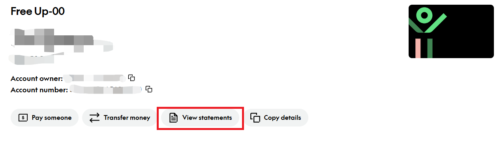
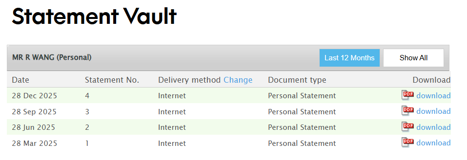
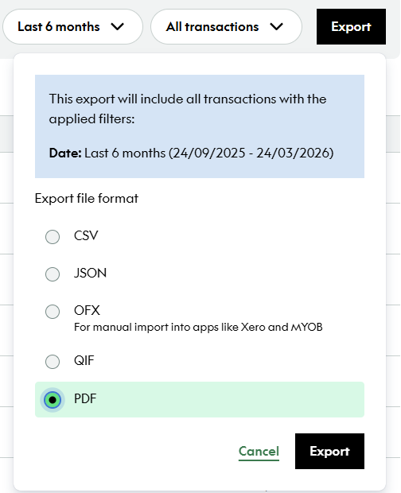

# Kiwibank Electronic Bank Statements

In New Zealand, Kiwibank customers can obtain electronic bank statements through the [Kiwibank website](https://www.kiwibank.co.nz/personal-banking/) for visa applications, rentals, and similar scenarios.

## Channels

- **Kiwibank Internet Banking**: log in on desktop at [kiwibank.co.nz](https://www.kiwibank.co.nz/personal-banking/)

## Steps

### 1. Log in and find the Document menu

Log in with your Kiwibank Access Number and password. After logging in, open the account for which you need to generate a statement. As shown below, click View statements to enter the export page.

### 2. Download Statement

Download the Statement for the required quarter.

::: tip
Note: Kiwibank Statements can only be exported by full quarter. If you need transactions within a specified date range, export Transactions using the method below.
:::

### 3. Download Transaction

On the account page, select the specified dates directly in the search row to export Transactions.

Choose the export format.

Set the Report type to Statement, choose PDF as the File Format, set the date range as needed, and download it.

## Notes

- It is recommended to save electronic statements as PDFs. Visa applications usually require documents in PDF format.

------

*Last edited: 2026-03-25      Author: [wrx012](https://github.com/wrx012)*
