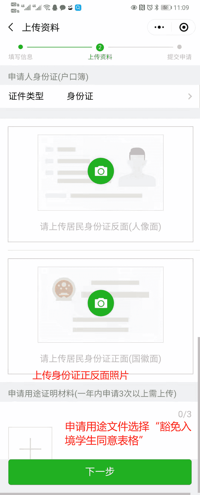

# Guangdong Province - Criminal Record Certificate

Residents of Guangdong Province can apply online for a criminal record certificate through the "粤省事" mini program without visiting an office in person.

::: tip
The following information is for reference only. Follow the latest process shown in "粤省事".
:::

## Channel

**粤省事** mini program / App

- Search for "粤省事" in WeChat or enter through the Guangdong Government Service Network portal

## What to Prepare

- **Your valid ID card**
- **Your real-name verified mobile number** (must match the "粤省事" account)
- **Application purpose** (for example: overseas visa, employment)
- **Collection method**: self-pickup or mail

## Steps

1. **Log in to 粤省事**
   - Open the 粤省事 mini program and complete real-name login

2. **Open the application entry**
   - Search for "无犯罪记录" on the homepage
   - Or go to "户政（治安）" -> "无犯罪记录证明"

   

3. **Fill in application information**
   - Select the application purpose, such as "办理出国（境）事务"
   - Fill in your household registration address, current residential address, and other details
   - Select the collection method (email)

    

4. **Upload materials**
   - Upload photos of the front and back of your ID card
   - Upload proof of application purpose if you have applied more than 3 times within one year

   

5. **Submit for review**
   - After submission, wait for review by the public security authority
   - Processing is generally completed within 1-3 working days

5. **Collect the certificate**
   - **Email**: search your mailbox for "无犯罪记录证明书"

   

## Notes

- Non-household-registered applicants applying in Guangdong must meet local residence or employment requirements. Follow the prompts in "粤省事".
- The certificate validity period varies by purpose. For visas, it is generally valid for 3-6 months, so it is recommended to apply close to the visa submission date.
- If online processing is unavailable, call the local public security bureau or visit an offline service counter for advice.

---
*Last edited: 2021-12-22* · Author: [Bald-M](https://github.com/Bald-M)
