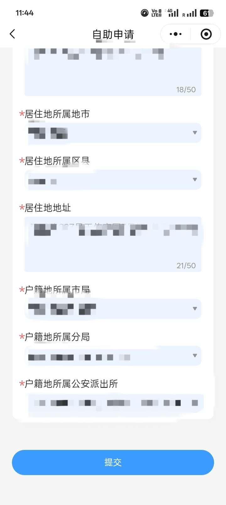

# Hebei Province - Criminal Record Certificate

Residents of Hebei Province can apply online for a criminal record certificate through the "河北省公安机关无犯罪记录证明" mini program without visiting an office in person.

## Channel

**河北省公安机关无犯罪记录证明** mini program / App

- Search WeChat for "河北省公安机关无犯罪记录证明" to enter

## What to Prepare

- **Your valid ID card**
- **Your real-name verification**
- **Mobile phone number**

## Steps

1. #### Enter the "河北省公安机关无犯罪记录证明" mini program
   
   Open the mini program, tap "无犯罪证明自主申请", register and log in. **Face recognition is required.**
   
   
   
2. #### Fill in information
   
   You need to fill in personal information and upload photos of the front and back of your ID card:

   

   Fill in "用途" according to your personal situation. It is recommended to set the query start and end dates from your date of birth to the application date. Fill in household registration and residence information according to your actual situation:
   
   
   
   
      
3. #### Submit and wait for public security review
      Results may be issued as soon as the same day:
      
- #### Notes
  If online processing is unavailable, call the local public security bureau or visit an offline service counter for advice.
------

*Last edited: 2026-03-21   Author: [wrx012](https://github.com/wrx012)*
