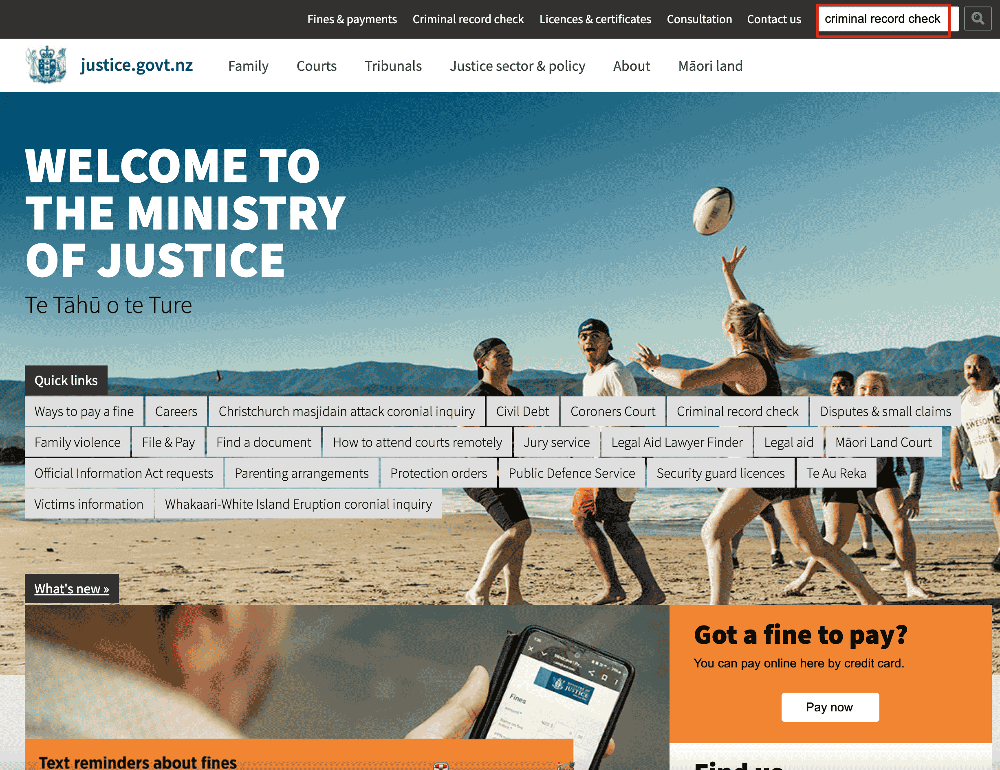
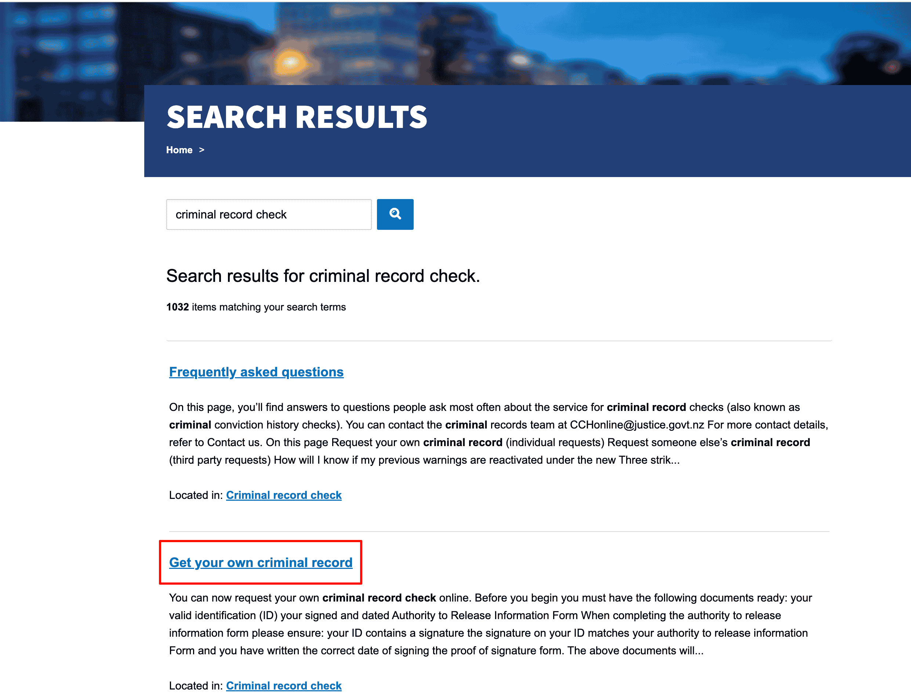
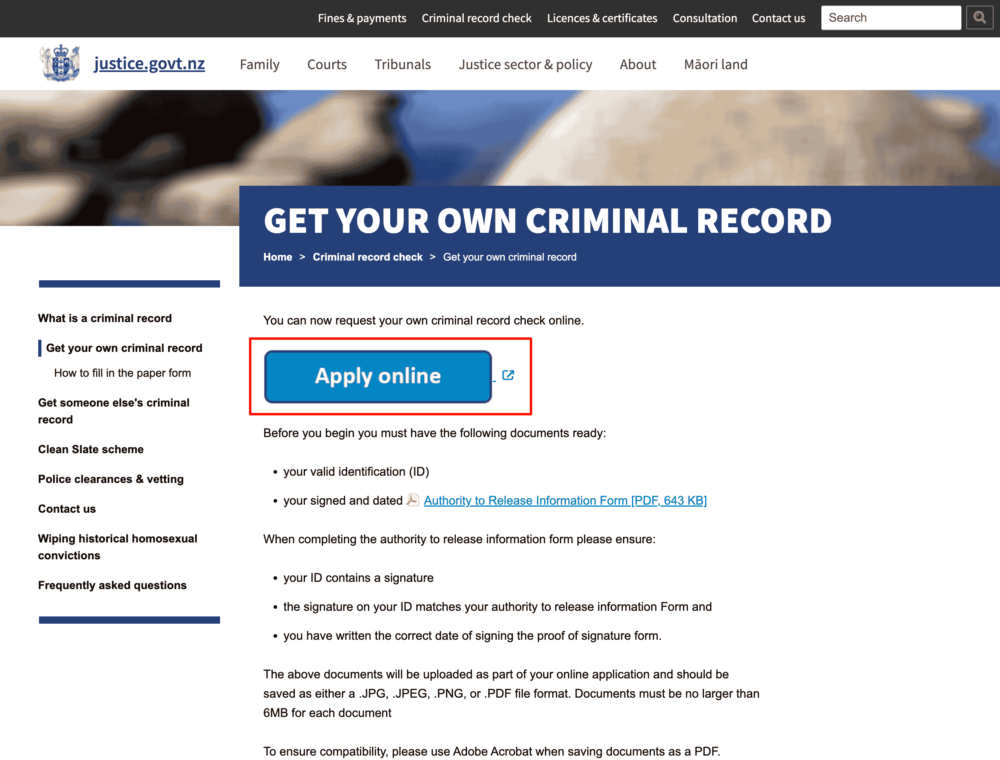
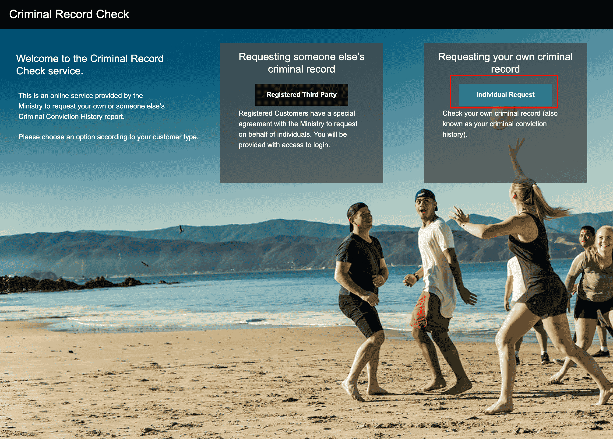
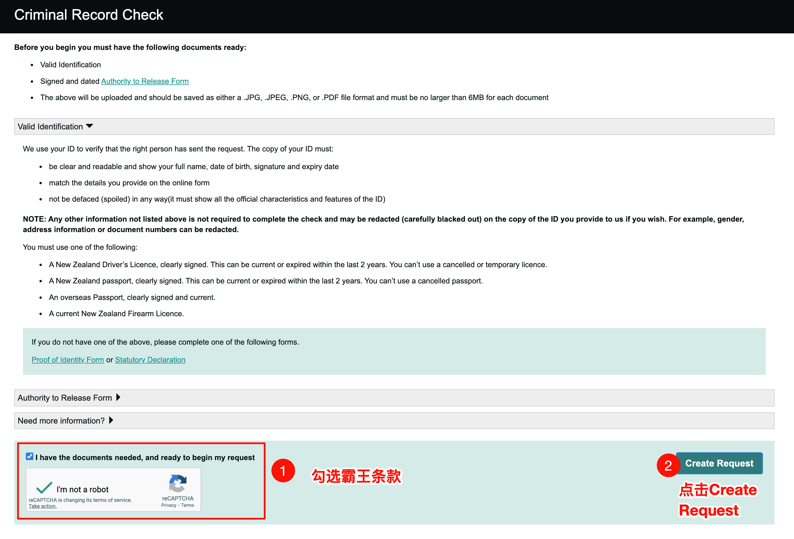
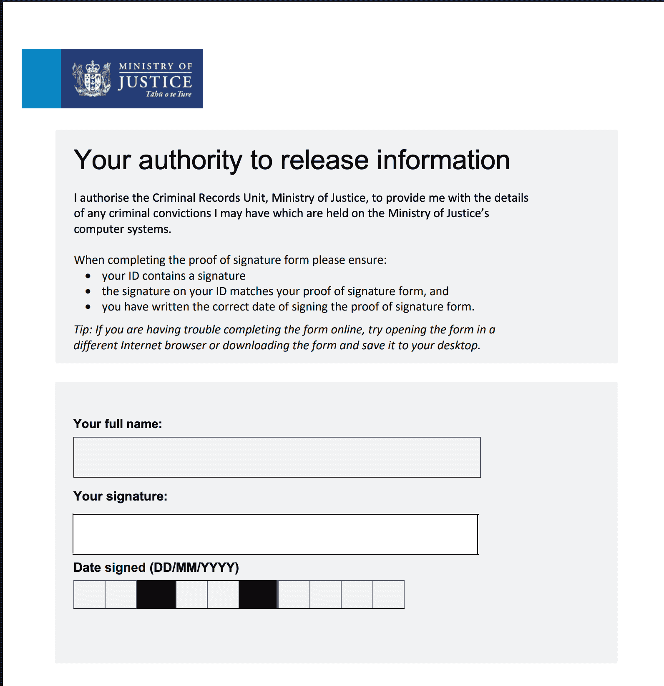

# Auckland - Criminal Record Certificate

New Zealand criminal record certificates (Criminal Conviction History / Police Clearance) are processed centrally by the Ministry of Justice. Auckland residents can apply online and do not need to attend in person.

::: tip
The process below is based on the New Zealand Ministry of Justice website (justice.govt.nz). It is for reference only. Follow the latest instructions on the official website.
:::

## Channel

**New Zealand Ministry of Justice website** · https://www.justice.govt.nz/

- Online applications are supported nationwide. Auckland residents also apply through this channel.

## What to Prepare

Before starting the application, prepare the following materials:

| Material | Description |
|----------|-------------|
| **Valid ID** | Passport, driver's licence, or another photo ID with a signature |
| **Authority to Release Information form** | Must be signed and dated by you. [Download the PDF from the official website](https://www.criminalrecords.govt.nz/forms/ProofofSignatureform_Final.pdf) |

::: warning Form requirements
- Your ID must contain your signature
- The signature on the form must match the signature on your ID
- The signing date must be correct
:::

**File format requirements**: .JPG, .JPEG, .PNG, and .PDF are supported. Each file must be no larger than 6MB. If saving as PDF, Adobe Acrobat is recommended for compatibility.

## Steps

### 1. Open the application entry

Option 1: open [justice.govt.nz](https://www.justice.govt.nz/) and click **Criminal record check** in the top navigation or Quick links.

Option 2: enter **criminal record check** in the official website search box and select **Get your own criminal record** from the results.

### 2. Prepare materials and download the form

On the **Get your own criminal record** page, confirm the required materials:

- Valid ID
- Signed and dated Authority to Release Information Form

Click **Apply online** to enter the online application system.

### 3. Select application type

After entering the Criminal Record Check online service, you will see two options:

- **Registered Third Party**: apply on behalf of someone else, requiring a registered organization account
- **Individual Request**: apply for your own criminal record

When applying for your own record, click **Individual Request**.

### 4. Confirm materials and create a request

On the **Criminal Record Check** page, confirm that you have prepared:

- Valid ID
- Signed and dated Authority to Release Form

Tick "I have the documents needed, and ready to begin my request", complete the reCAPTCHA verification, and click **Create Request**.

### 5. Authorisation

Read the **Individual authorisation** page. It explains that Information Management Group will collect and submit the information to the Ministry of Justice, and personal data will be removed from the system after 3 months. Click **Continue** after agreeing.

### 6. Fill in applicant information

On the **Request Details** page, fill in:

- Name (First name, Surname, Middle name)
- Whether you have used any other names
- Date of birth, gender, place of birth
- Email and contact phone number
- New Zealand driver's licence number, if using a driver's licence as ID

After completing the form, click **Next**.

### 7. Fill in address

On the **Applicant address** page, fill in:

- Current address, including street number, street name, suburb, city, postcode, country, and other details
- Whether you have had other addresses in New Zealand in the past 10 years; add each one if applicable

After completing the form, click **Next**.

### 8. Select report type

On the **Report** page, choose whether you need your full criminal record:

- **Yes**: obtain the full conviction record in the Ministry of Justice system (**choose Yes for visa purposes**, such as immigration or overseas visas)
- **No**: do not obtain the full record (used when providing it to employers, recruitment agencies, insurance companies, and other third parties)

::: tip Visa purposes
If it is for immigration or an overseas visa, choose **Yes**. If it is for an employer, agent, or another third party, choose **No**.
:::

### 9. Upload materials

On the **Upload** page, upload:

- **Applicant identification**: ID document. For a New Zealand driver's licence, upload Page 1 and Page 2. For a passport, upload the personal information page.
- **Authority to Release form**: signed and dated Authority to Release Information form PDF

.JPG, .JPEG, .PNG, and .PDF are supported. Each file must be no larger than 6MB. After uploading, click **Next**.

::: tip Authority to Release form
When filling in the form, make sure your ID has your signature, the form signature matches your ID signature, and the signing date is correct. See the [official PDF](https://www.criminalrecords.govt.nz/forms/ProofofSignatureform_Final.pdf) for details.
:::

### 10. Declare and submit

Read the **Declaration**, confirm that the information is true, complete the declaration, and submit the application.

### 11. Submission successful

After submission, the page will show **REQUEST SUBMITTED**. You can optionally enter an email address to receive a confirmation email, or click **Return to Home**.

### 12. Check the confirmation email

After the application is accepted, you will receive an **Acknowledgement** email confirming that your request has been received. You can click the link in the email to view progress and estimated processing time.

## Related Links

- **New Zealand Ministry of Justice website**: https://www.justice.govt.nz/
- **Criminal record check topic page**: https://www.justice.govt.nz/criminal-records/
- **Contact email**: CCHonline@justice.govt.nz

## Notes

- Applying for your own record is an **Individual Request**. Applying for someone else's record requires **Registered Third Party**.
- The certificate validity period varies by purpose. For visas, it is generally valid for 3-6 months, so it is recommended to apply close to the visa submission date.
- If you have questions, email CCHonline@justice.govt.nz or refer to the Contact us page on the official website.

---
*Last edited: 2026-03-15* · Author: [Bald-M](https://github.com/Bald-M)
