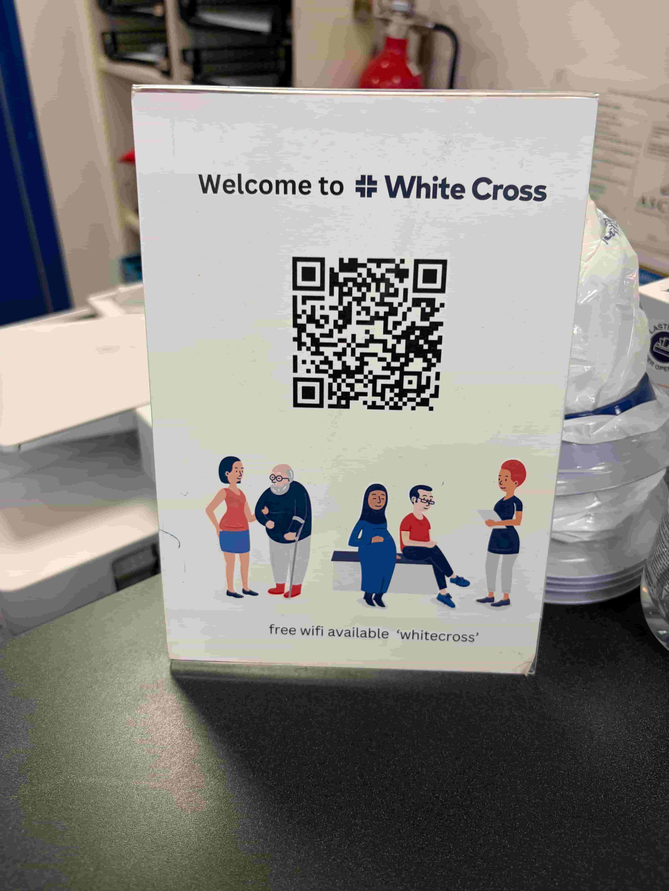
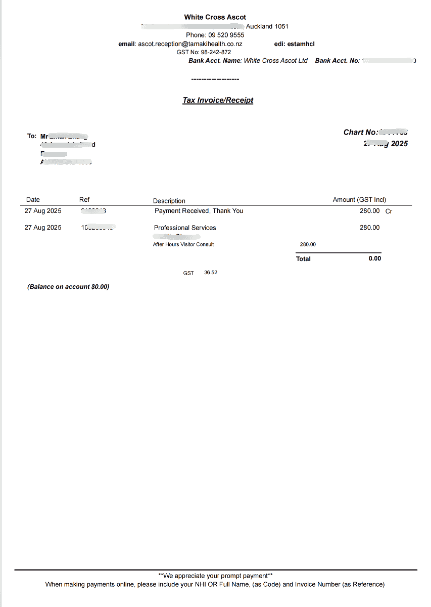

# White Cross Visit Process

White Cross is a common **After Hours** and **Urgent Care** clinic chain in New Zealand, providing medical services outside normal hours and some urgent care services.

::: tip
Addresses and opening hours vary by White Cross location. Before you go, check the [official website](https://www.whitecross.co.nz/) or call to confirm.
:::

## Suitable Situations

- Feeling unwell outside normal hours, such as evenings, weekends, or public holidays
- Urgent but not life-threatening situations: fever, injury, allergies, minor fractures, and similar issues
- Conditions that need prompt treatment but do not require calling an ambulance

## Visit Process

### 1. Find a nearby clinic

- Visit the [White Cross website](https://www.whitecross.co.nz/) to find a location
- Or search for "White Cross" + your city in a map app

### 2. Go to the clinic

- Most locations accept **walk-ins**, with no appointment required
- Some locations may require a phone call to confirm whether they are open and have capacity

### 3. Register and wait

- After arriving, scan the QR code at reception to register
- Show your passport, driver's licence, or other ID
- Fill in brief condition information
- Wait to be called

### 4. Basic checks

- Wait for the nurse to call you
- Cooperate with the nurse for the following checks:
  - Blood glucose
  - Urine test
  - Blood pressure

### 5. Consultation and payment

- Enter the consultation room when called and explain your symptoms to the doctor
- After the consultation, pay at reception (cash/card)

::: warning Must-have reimbursement documents
**Make sure to ask reception for the following documents** for later reimbursement:
- **Tax Invoice**
- **Consultation Note**

Both are required. Without either one, reimbursement may fail.
:::

**Tax Invoice example:**

**Consultation Note example:**

### 6. Pick up medicine, if needed

- If the doctor prescribes medicine, you can pick it up at a nearby pharmacy
- Some White Cross locations have a pharmacy next to or inside the clinic

## Fees and Reimbursement

- Fees are usually higher than a regular GP visit. The exact amount depends on the location.
- If you have student insurance, travel insurance, or similar coverage, you may be able to claim reimbursement. See [Medical Reimbursement](/en/medical-care/reimbursement/).

::: warning Required for reimbursement
After payment, **make sure to ask reception for** both the **Tax Invoice** and **Consultation Note**. These are required materials for insurance reimbursement, and requesting them after leaving the clinic can be inconvenient.
:::

## Related Links

- [White Cross website](https://www.whitecross.co.nz/)
- [Medical Reimbursement](/en/medical-care/reimbursement/)

---
*Last edited: to be added* · Author: [Bald-M](https://github.com/Bald-M)
