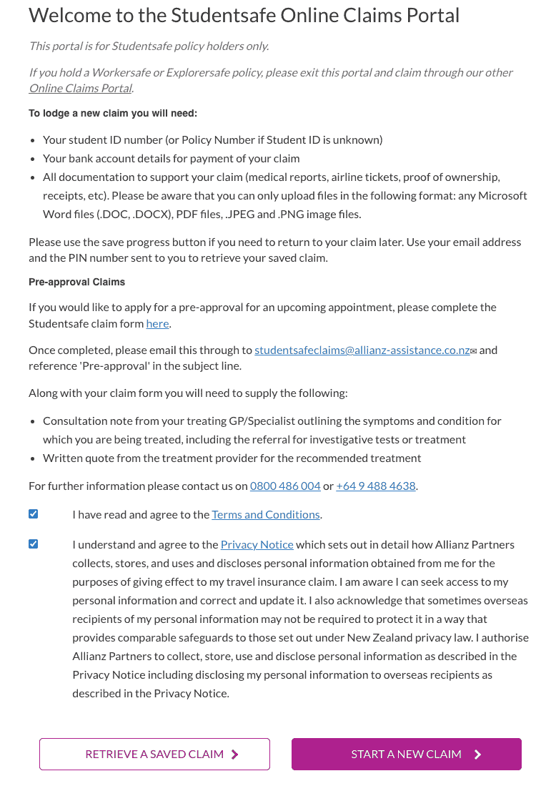
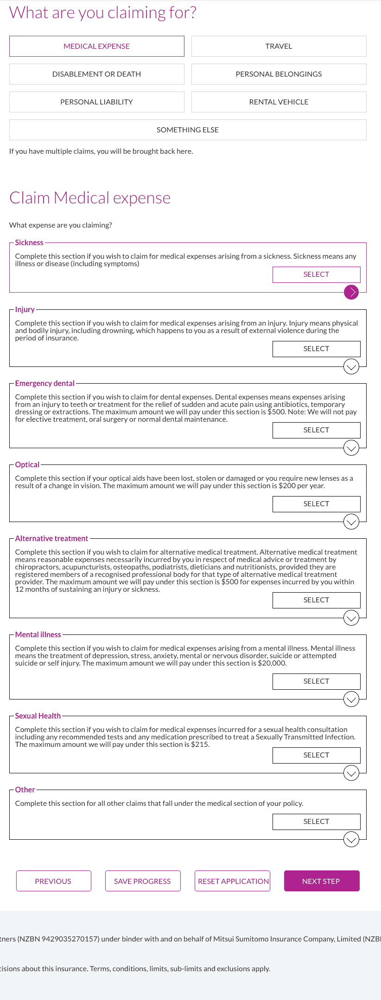
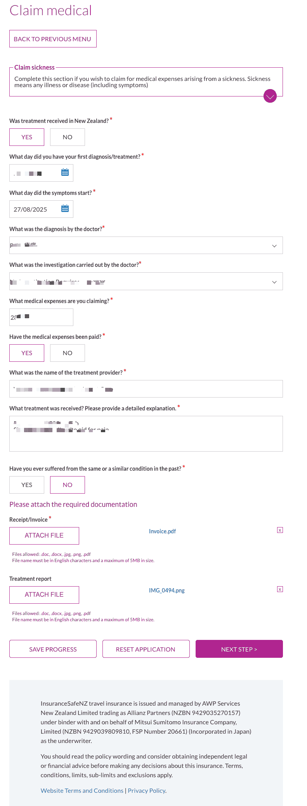
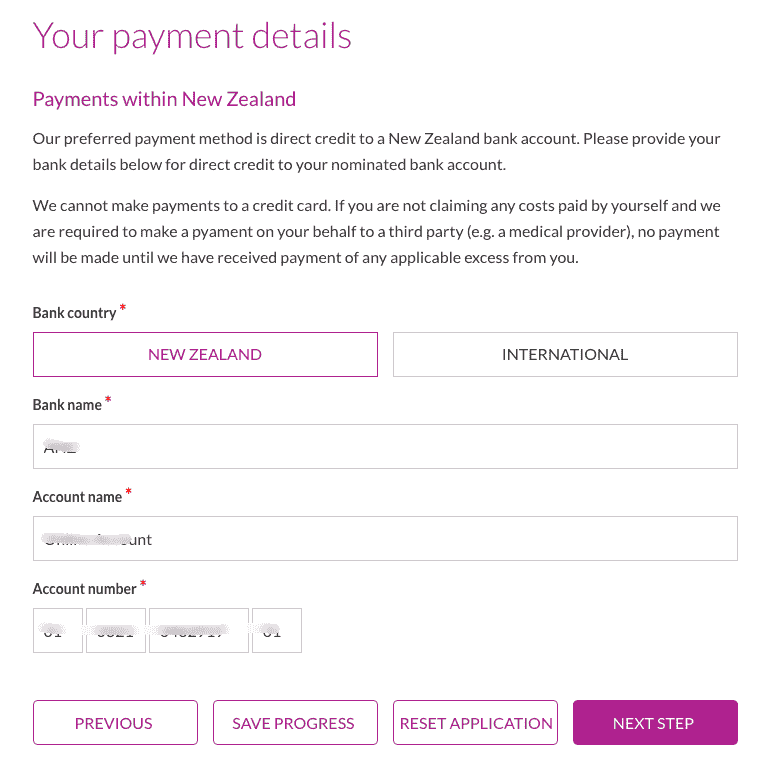
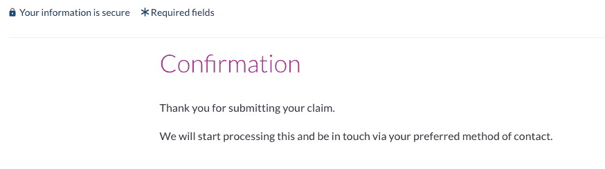
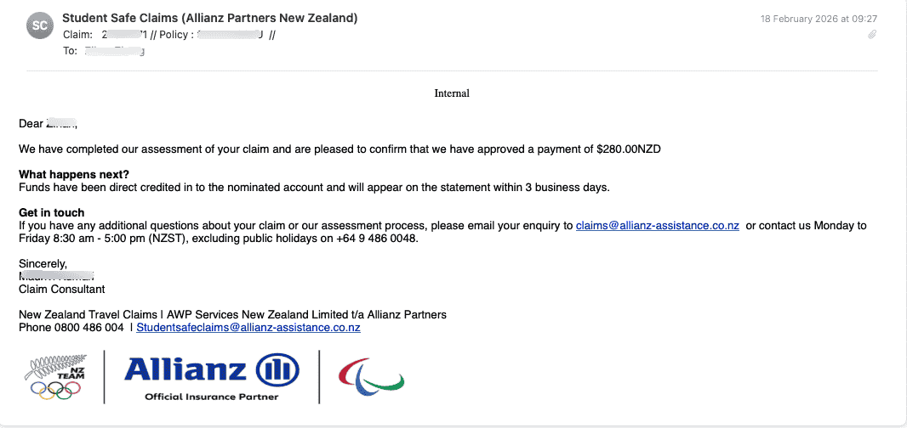

# Student Insurance Reimbursement

Student visa holders are usually covered by **Student Insurance** purchased through their school, such as Studentsafe. It covers GP visits, some specialist care, emergency care, and more. This guide uses the [InsuranceSafe online claims portal](https://www.insurancesafenz.com/claimsportal/) as an example to explain the student insurance reimbursement process.

::: tip
Insurance partners and policy details vary by school. If your school uses InsuranceSafe/Studentsafe, you can refer to this guide. Otherwise, check the specific process on your insurer's official website.
:::

## Before Claiming

### Required Materials

- **Tax Invoice / Receipt** -> Receipt/Invoice in the portal
- **Consultation Note** (medical record / diagnosis note) -> Treatment report in the portal
- Student ID or policy number
- New Zealand bank account details for payment

::: warning
Some clinics do not proactively provide a Consultation Note. During your visit, ask reception or the doctor for it. See the required materials to ask for when visiting [White Cross](/en/medical-care/emergency/white-cross/).
:::

### Supported File Formats

- Word (.doc, .docx), PDF, JPEG, PNG
- File names must use English characters, and each file must be no larger than 5MB

## Studentsafe Online Claims Process

This applies to the [InsuranceSafe Studentsafe portal](https://www.insurancesafenz.com/claimsportal/) managed by Allianz Partners.

### 1. Enter the portal and start a new claim

Open the [Studentsafe Online Claims Portal](https://www.insurancesafenz.com/claimsportal/).

Tick the **Terms and Conditions** and **Privacy Notice** boxes at the bottom, then click **START A NEW CLAIM**.

### 2. Fill in personal information

Fill in the information required by the page:

- Student ID (or policy number), name, date of birth
- Mobile/landline (at least one), email
- New Zealand address
- Institution, course type, course start and end dates, visa expiry date
- Whether claiming for a family member, whether authorizing someone else to handle the claim, and whether you have claimed or will claim elsewhere

When complete, click **NEXT STEP**.

### 3. Select claim type

Select **MEDICAL EXPENSE**.

### 4. Select medical expense subtype

Choose according to your situation:

| Type | Description / limit |
|------|---------------------|
| Sickness | Medical expenses related to illness |
| Injury | Medical expenses related to accidental injury |
| Emergency dental | Emergency dental care, such as acute toothache, up to $500 |
| Optical | Lost/damaged glasses or lens replacement, up to $200 per year |
| Alternative treatment | Chiropractic, acupuncture, podiatry, and other alternative therapies, up to $500 |
| Mental illness | Mental health related, up to $20,000 |
| Sexual Health | Sexual health checks and treatment, up to $215 |
| Other | Other medical expenses |

For an ordinary doctor visit, select **Sickness** or **Injury**, then click **SELECT**.

### 5. Fill in claim details and upload materials

Fill in the diagnosis date, symptom start date, diagnosis details, examination/treatment details, medical expense amount, whether you have paid, provider name, and similar information.

Under **Please attach the required documentation**, upload:

- **Receipt/Invoice**: Tax Invoice
- **Treatment report**: Consultation Note

### 6. Declaration and authorisation

Read the **Declaration**, tick/confirm that the information is true and correct, fill in your name, student ID, and date, then click **NEXT STEP**.

### 7. Fill in payment information

Provide your New Zealand bank account details for direct payment:

- Bank country: select New Zealand
- Bank name, account name, account number

::: info
Payment to credit cards is not supported. If the insurer needs to pay the medical provider directly, you need to pay the applicable excess first.
:::

### 8. Review and submit

On the **Review and submit** page, check your information and uploaded files. If anything is wrong, click Edit to change it. After confirming everything is correct, click **NEXT STEP** to submit.

### 9. Submission successful

After submission, a confirmation page will appear, saying processing will begin and the team will contact you through your selected contact method.

### 10. Claim paid

After approval, you will receive an email notification. The payment will be deposited directly into the bank account you provided, usually within 3 working days.

## Pre-approval

If you want to obtain pre-approval before treatment:

1. Download the [Studentsafe claim form](https://www.insurancesafenz.com/claimsportal/pdfs/Studentsafe_Claim_Form.pdf)
2. Prepare:
   - Consultation Note from your GP/specialist (symptoms, diagnosis, recommended examination/treatment)
   - Written quote from the treatment provider
3. Email [studentsafeclaims@allianz-assistance.co.nz](mailto:studentsafeclaims@allianz-assistance.co.nz) with **Pre-approval** in the subject line

## Saving Progress

During the process, you can click **SAVE PROGRESS**. Later, continue using your email and the PIN sent by the system.

## Contact

- Phone: 0800 486 004 or +64 9 488 4638
- Email: studentsafeclaims@allianz-assistance.co.nz
- Hours: Monday to Friday 8:30-17:00 (New Zealand time, excluding public holidays)

## FAQ

### Which providers can be reimbursed?

Before visiting, call 0800 486 004 to confirm whether the clinic/hospital is on the approved list. Common providers such as GPs and White Cross are usually claimable.

### How long does reimbursement take?

Generally 1-4 weeks. After approval, payment is usually received within about 3 working days.

### Workersafe / Explorersafe policies

If you hold a Workersafe or Explorersafe policy, use the [other claims portal](https://www.claimmanager.co.nz/) instead of the Studentsafe portal.

## Related Links

- [Medical Reimbursement](/en/medical-care/reimbursement/): reimbursement overview
- [White Cross](/en/medical-care/emergency/white-cross/): remember to ask reception for the Tax Invoice and Consultation Note during urgent care visits
- [Studentsafe claims portal](https://www.insurancesafenz.com/claimsportal/)
- [University of Auckland student medical insurance reimbursement full process](http://xhslink.com/o/2hB2JlrR0Qf) (Xiaohongshu)

---
*Last edited: 2026-01-10* · Author: [Bald-M](https://github.com/Bald-M)
