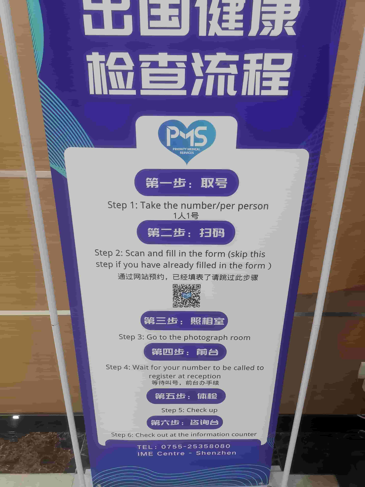

# Pre-departure Medical Exam - Chest X-ray

When applying for a visa, you usually need to provide a chest X-ray medical report from a designated hospital. This guide explains what to prepare, the exam process, and key notes.

::: tip
The information below is for reference only. Before you go, call the hospital to confirm the latest requirements and fees.
:::

## Hospital Information

Shenzhen Luohu District Chronic Disease Prevention and Treatment Hospital

| Item | Details |
|------|---------|
| Address | No. 11 Jinhu Road, Luohu District, Shenzhen, Guangdong |
| Hours | Monday to Sunday 8:00-12:00, 14:00-17:00 |
| Phone | 0755-25358080 |

## What to Prepare

- **Two 2-inch white-background photos** (they may not be needed on site, but it is recommended to bring them as backup)
- **Passport**: original + photocopy
- **Fee**: cash or Alipay (about RMB 750; price may change)
- **Black pen** (for filling in forms)

## Exam Process

- After arriving on the second floor of the hospital, take a queue number from the machine beside the elevator.
- The second step is an on-site photo. Your ears and eyebrows need to be visible. The staff member taking the photo will ask which country you are going to. At this point you also need to provide a white-background ID photo. After the photo is taken, they will give you a form to fill in on site.
- After completing the form, wait for your number to be called. This step is for signing and payment.
- Then the medical exam begins. You enter the exam area using facial recognition. A nurse will guide you and give you a wristband and loose clothing. First go to the changing room. Female applicants should tie up their hair, remove their bra, and change into the provided slippers. In other words, everything except underwear, the hospital clothing, and the wristband needs to be stored away.
- In one room, scan your wristband first. The doctor will ask whether any family members have had tuberculosis and whether you have recently had a cold or fever. Answer truthfully.
- Then it is finally time to queue for the exam. Sit on the sofa outside and wait for your name to be called.
- After the exam, change back into your own clothes, return the wristband at the consultation desk, and tell them whether you will collect the result the same day or have it mailed cash-on-delivery. Same-day pickup results are available between 3 pm and 4 pm. For mailing, they use SF Express. You fill in the delivery information on your phone on site, and it is sent out the same day. I chose delivery, and it arrived the next morning within the same city. After that, you can leave.

::: info Source
https://www.xiaohongshu.com/discovery/item/60b5fa6700000000010288e1?ivk_sa=1024320u
:::

---
*Last edited: 2022-04-02* · Author: [Bald-M](https://github.com/Bald-M)
