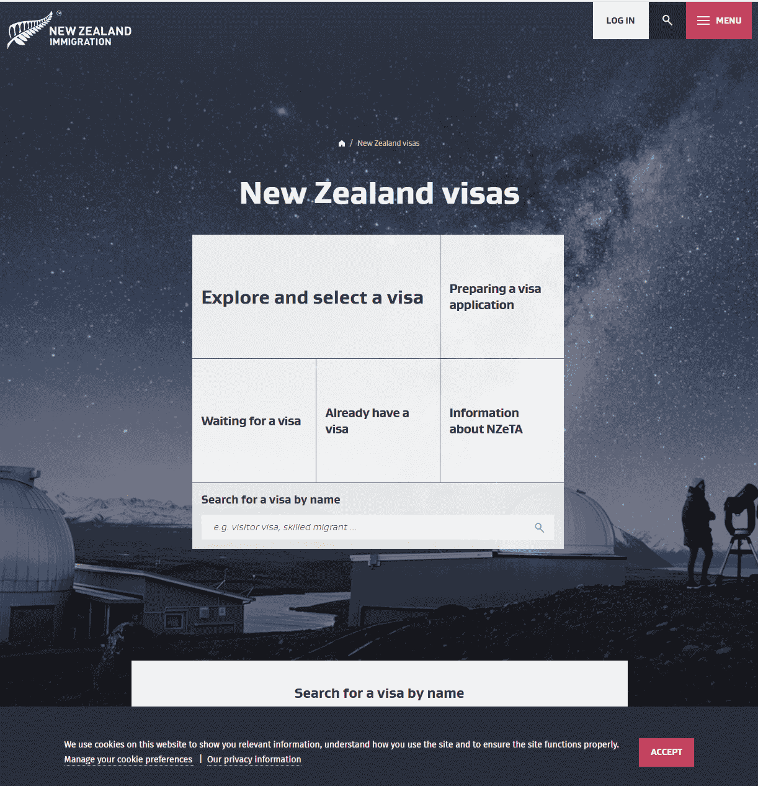
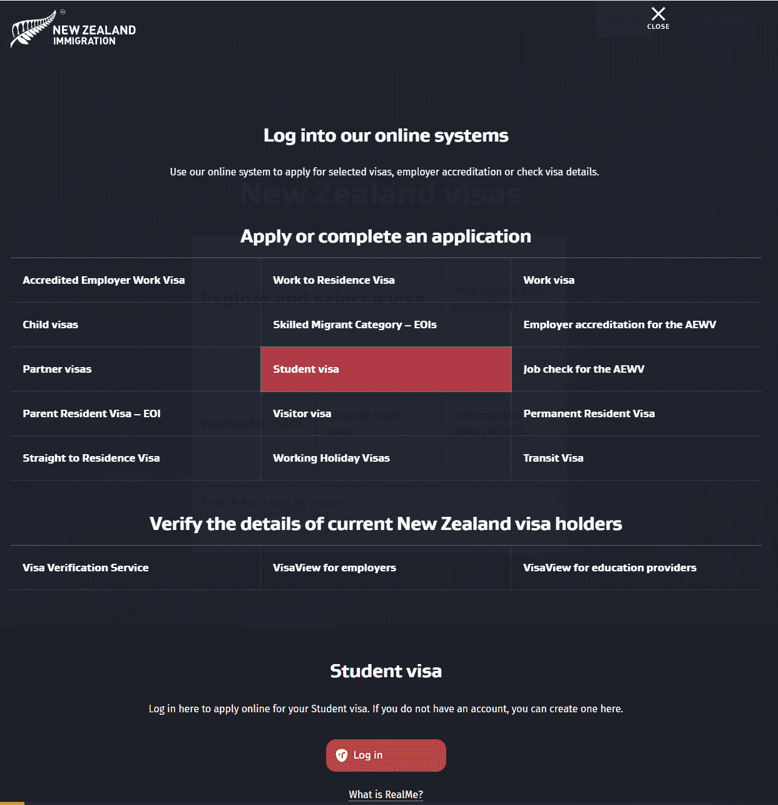
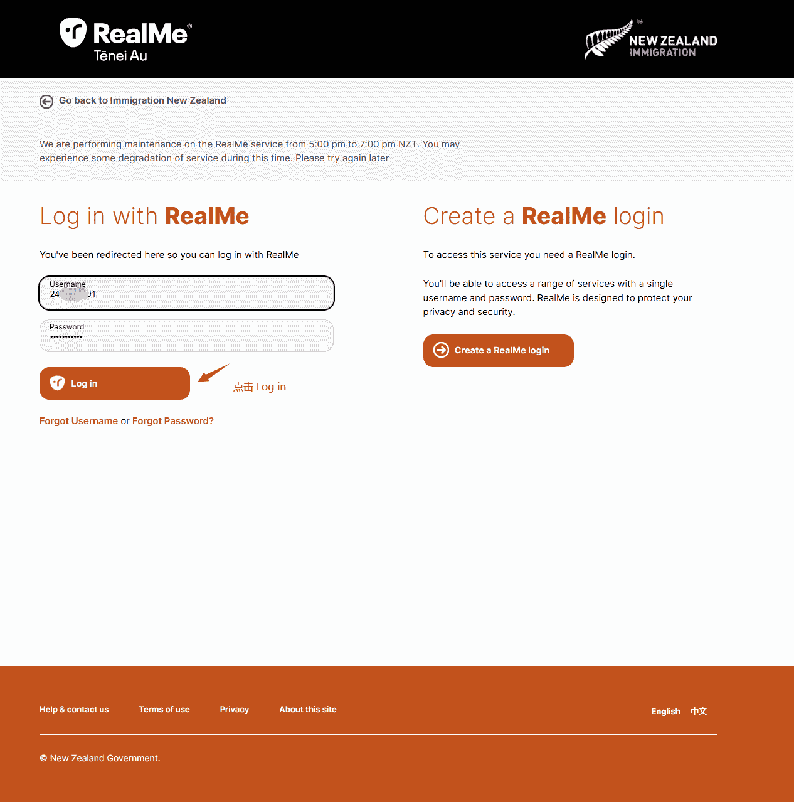
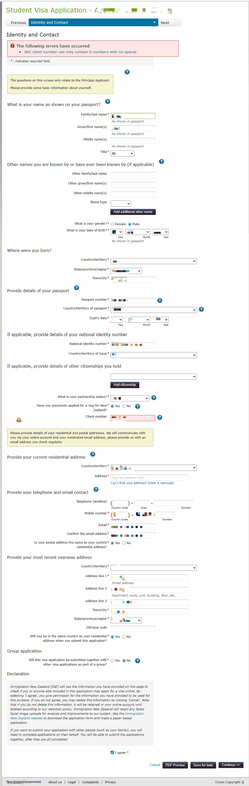
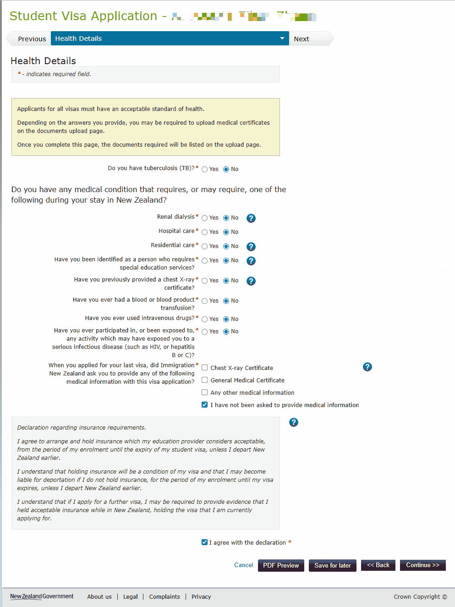
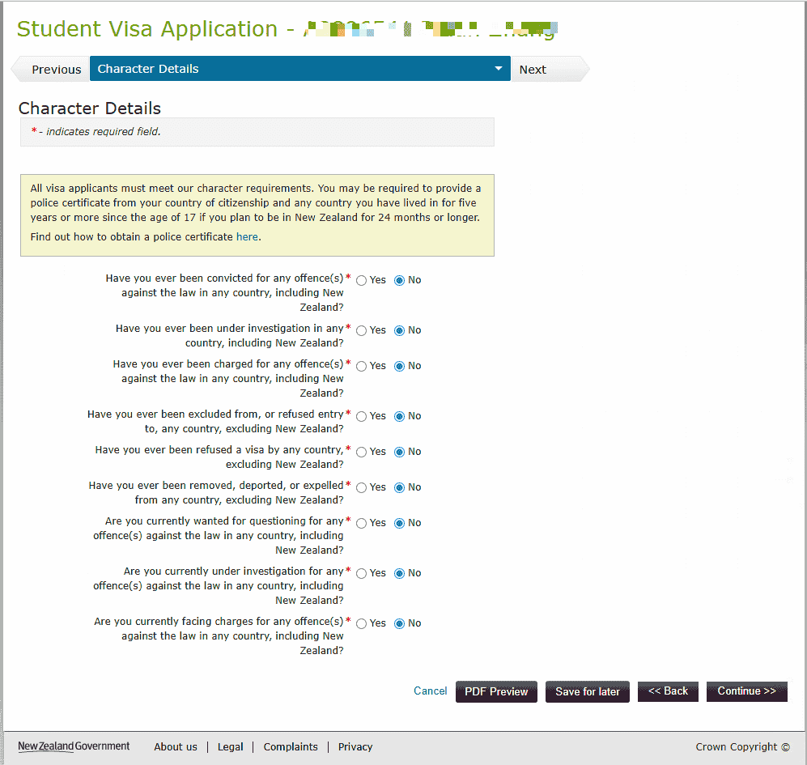
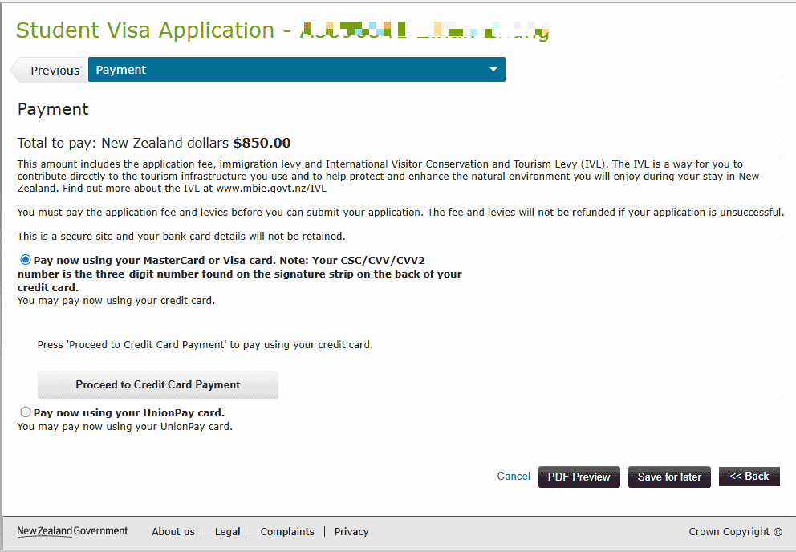

# Student Visa

New Zealand Student Visa applications must be submitted online through the Immigration New Zealand website using a RealMe account.

::: tip
The following information is based on the process as of January 2025. Follow the latest requirements on the Immigration New Zealand website.
:::

## Materials to Prepare

| Material | Description |
|----------|-------------|
| **Passport bio page photo** | Clear scan of the personal information page |
| **Offer** | Offer of place from a New Zealand education provider |
| **Transcript** | Must be an official **Academic Transcript** |
| **Tuition payment evidence** | Proof that tuition has been paid |
| **Proof of funds** | Enough money to live in New Zealand (bank statements); see [Bank Statements](/en/bank-statement/) |
| **Visa card** | Used to pay visa fees and similar costs |
| **Evidence of outward travel** | Such as flight tickets |
| **eMedical Reference Code** | The eMedical number is sent to your email by the sender "eMedical" a few working days after completing the chest X-ray medical exam |

## About the Chest X-ray Medical Exam

- **Validity**: the chest X-ray is valid for **36 months**
- **When exempt**: if this is not your first application and your previous chest X-ray has not expired, you do not need to complete it again
- See [Pre-departure medical exam - chest X-ray](/en/pre-departure-medical/)

## Application Process

### 1. Open the Immigration New Zealand visa page

Visit [immigration.govt.nz](https://www.immigration.govt.nz/) and open the "New Zealand visas" page. You can choose "Explore and select a visa" or use the search box to find "Student visa".

### 2. Select Student Visa and log in

On the "Log into our online systems" page, find the **Student visa** option and open it. In the "Student visa" section below, click the red **Log in** button. If you do not have an account, you can create one there.

### 3. Log in with RealMe

- **Existing RealMe account**: enter your username and password, then click **Log in**
- **No account**: click "Create a RealMe login" on the right to register a RealMe account

### 4. Create a new Student Visa application

After logging in, go to My account. Under Create a new application, click Student Visa.

### 5. Fill in and submit online

After logging in, follow the prompts to complete the application form, upload materials, pay the visa fee, and submit.

 

 

 

 

 

 

 

 

 

 

## Notes

- Search your email for the sender "eMedical" to obtain the eMedical number. It is usually received a few working days after the medical exam.
- The transcript must be an official Academic Transcript issued by the school, not an ordinary grade report.
- QQ Mail may block Immigration New Zealand emails. If you do not receive an email, check the spam folder.

---
*Last edited: 2025-01-23* · Author: [Bald-M](https://github.com/Bald-M)
