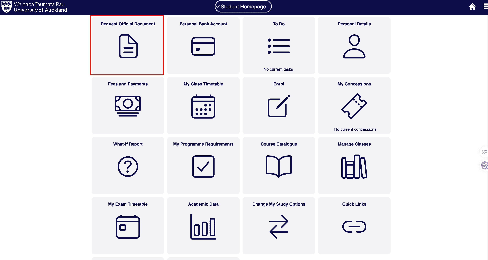
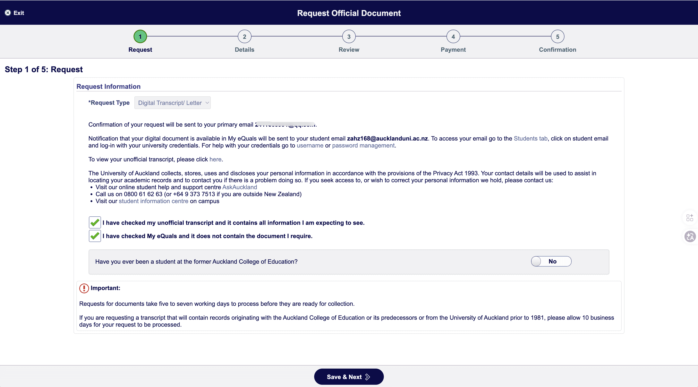
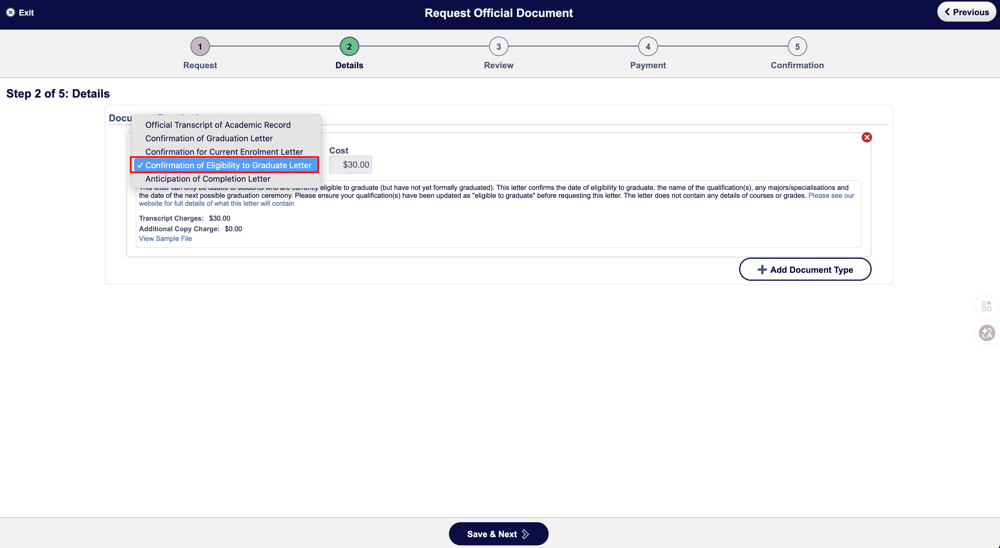
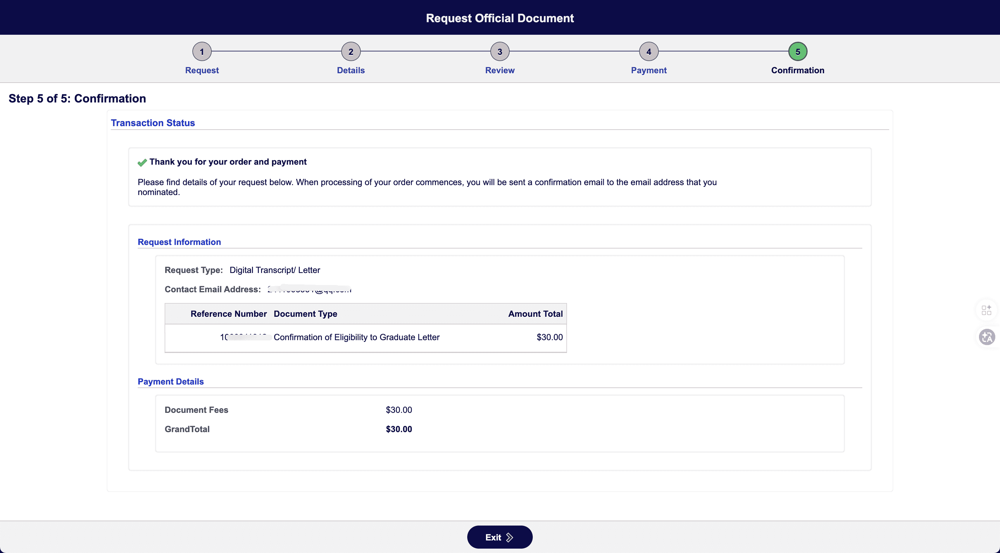
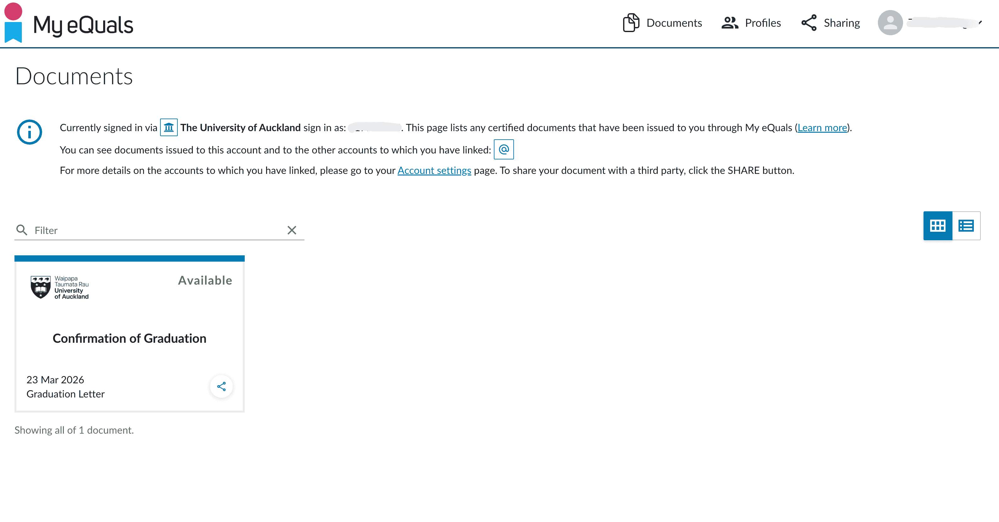

# Completion Letter

A Completion Letter is an important document for applying for a Post-study Work Visa. At the University of Auckland, the official name of this document is **Confirmation of Eligibility to Graduate Letter**, and it must be requested online through the student portal.

::: tip
This guide uses the **University of Auckland** as an example. Processes at other institutions may differ. Follow your own school's official website.
:::

## Before Applying

- Student account that can log in to Student Homepage
- System status updated to **eligible to graduate**
- It is recommended to first check your [unofficial transcript](https://www.auckland.ac.nz/) to confirm that grades and course information are correct

::: warning
This letter can only be issued to students who are **currently eligible to graduate but have not yet formally graduated**. If the system does not show "eligible to graduate", contact the school first to update the status.
:::

## Fee and Processing Time

| Item | Description |
|------|-------------|
| Fee | $30 NZD |
| Processing time | Usually 5-7 working days |
| Special cases | Records from before 1981 or from the former Auckland College of Education may take about 10 working days |

## Application Process (University of Auckland)

### Step 1: Open Request Official Document

Log in to [SSO](https://www.auckland.ac.nz/en/students/my-tools/sso.html), find **Request Official Document** on the homepage, and click it.

### Step 2: Request

1. **Request Type**: select **Digital Transcript/ Letter**
2. Confirm that the digital file will be sent to your student email through **My eQuals**
3. Tick:
   - "I have checked my unofficial transcript and it contains all information I am expecting to see."
   - "I have checked My eQuals and it does not contain the document I require."
4. Click **Save & Next**

::: tip
Before applying, check [My eQuals](https://www.myequals.net/) to confirm whether the document is already available, so you do not apply again unnecessarily.
:::

### Step 3: Details (select document type)

1. **Document Type**: select **Confirmation of Eligibility to Graduate Letter**
2. Confirm the fee is **$30.00**
3. The letter includes:
   - Date of eligibility to graduate
   - Qualification/degree name
   - Major/specialization
   - Most recent graduation ceremony date
4. It does not include courses and grades, which are in the Transcript
5. Click **Save & Next**

### Step 4: Review

Check the request type, document type, and amount ($30). After confirming everything is correct, click **Save & Next**.

### Step 5: Payment

1. Choose a payment method:
   - **Pay by Internet Banking (Account 2 Account)**
   - **Pay by Credit Card**
   - **Pay by China UnionPay**
2. Payment amount: **$30.00**
3. Click **Continue with payment** to go to the payment page

4. Confirm the amount is $30.00 and click **Continue** to complete payment

::: warning
If a **Windcave Exception** message appears, it is usually because the browser version is too old. Update or switch browsers and try again.
:::

### Step 6: Confirmation

After payment succeeds, the page will show "Thank you for your order and payment". Once processing begins, a confirmation email will be sent to the email address you entered. The digital file will be sent to your student email through **My eQuals**.

## How to Receive It

1. **Check email**: after processing is complete, you will receive an email notification from My eQuals
2. **Log in and download**: go to [My eQuals](https://www.myequals.net/) and log in with your University of Auckland account. On the **Documents** page, find **Confirmation of Graduation** or **Confirmation of Eligibility to Graduate Letter**. When the status is **Available**, click to download the PDF
3. **Use for visa**: upload the PDF as the Completion Letter in the Immigration New Zealand application

## Notes

- Apply after **all grades are confirmed and your degree status has been updated to eligible to graduate**
- Before applying, confirm that My eQuals does not already contain the document to avoid paying twice
- Digital letters generally do not have a clear expiry date, but it is recommended to obtain one within 3 months before submitting the visa application

## Related Links

- [Post-study Work Visa overview](/en/visa/work-visas/post-study-work-visa/)
- [Immigration New Zealand online application process](/en/visa/work-visas/post-study-work-visa/immigration-application/)
- [University of Auckland Student Homepage](https://www.auckland.ac.nz/)
- [My eQuals](https://www.myequals.net/)

---
*Last edited: 2026-03-23* · Author: [Bald-M](https://github.com/Bald-M)
