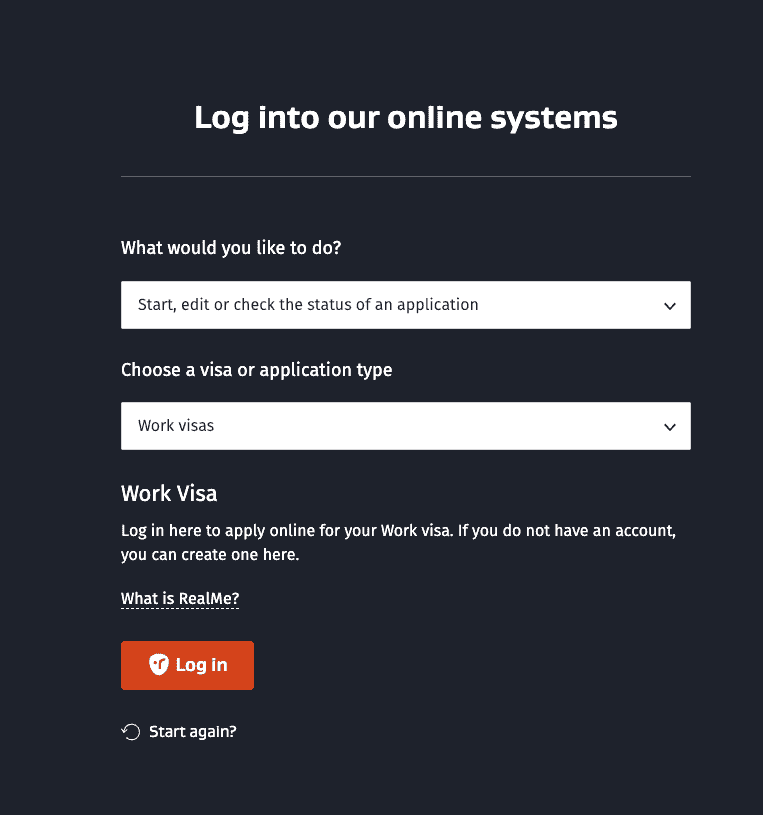
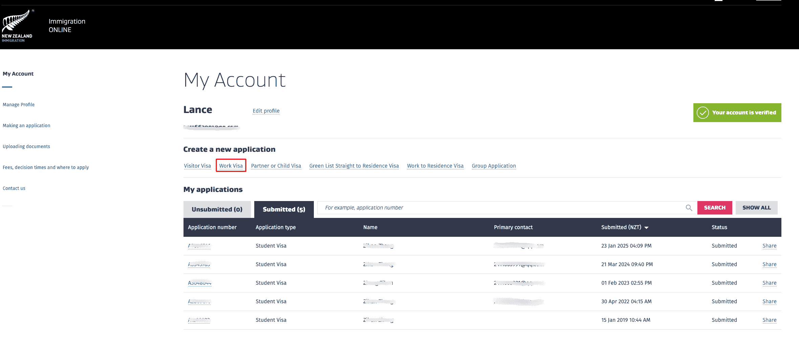
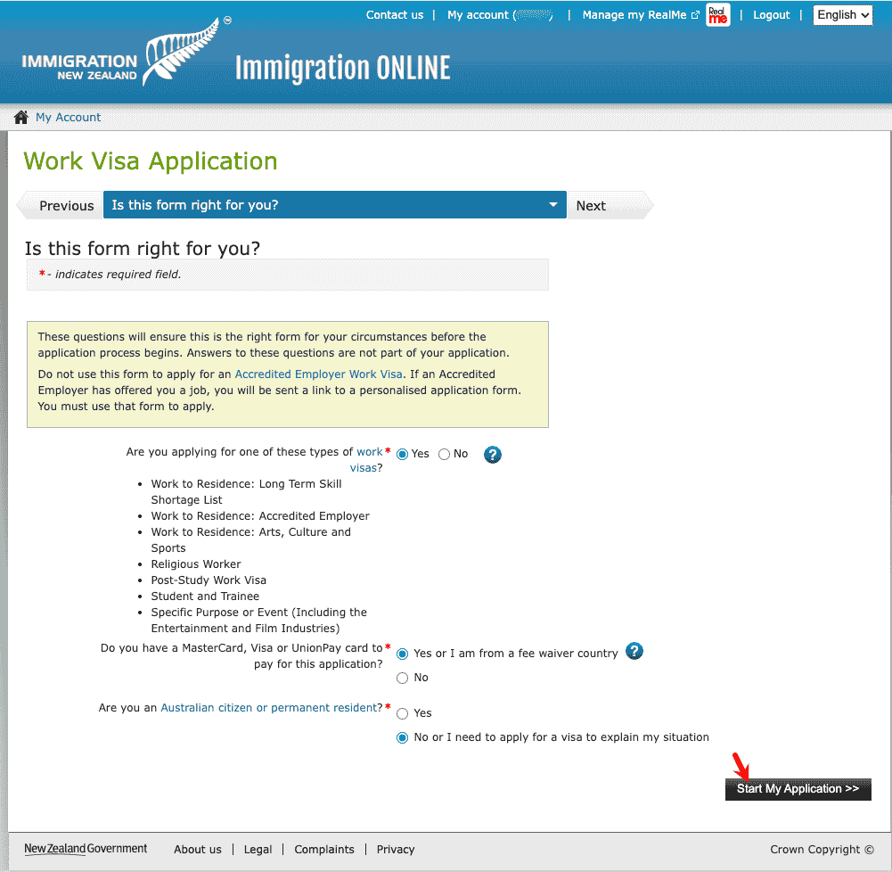
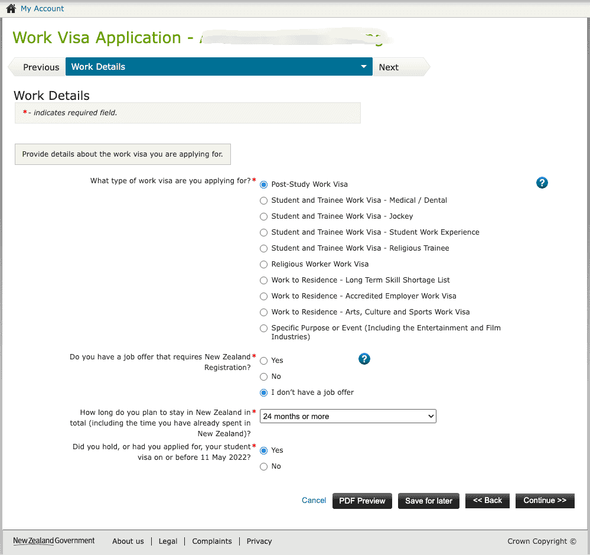
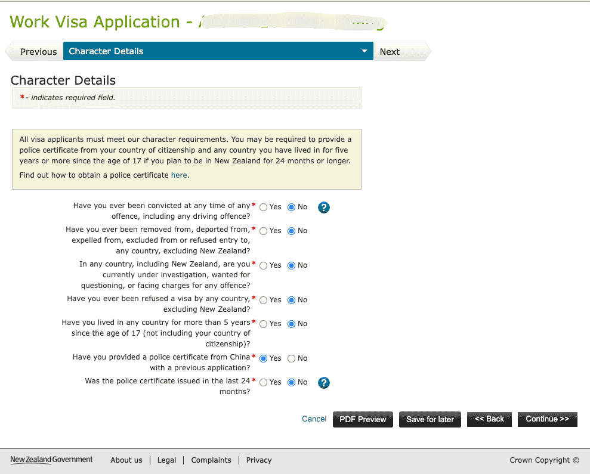
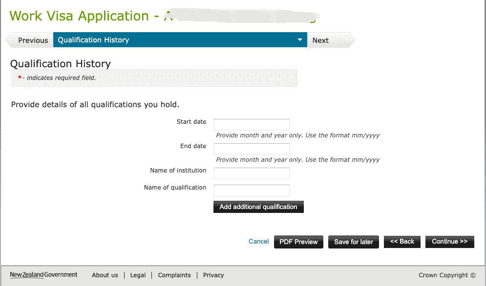
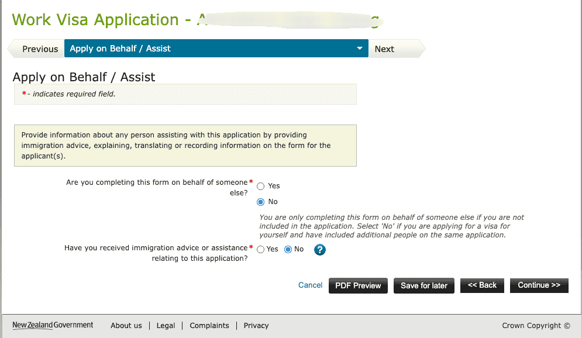
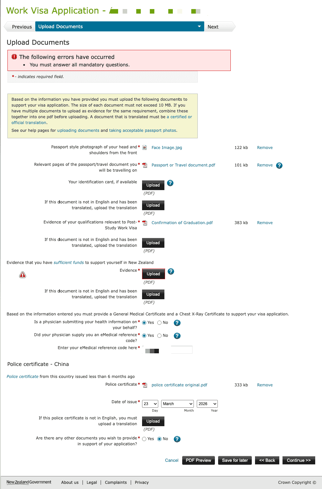

# Immigration New Zealand Online Application Process

A Post-study Work Visa application must be submitted online through the Immigration New Zealand website. This guide explains the detailed process from login to submission.

::: tip
Before applying, make sure you have completed the [medical exam](/en/visa/work-visas/post-study-work-visa/medical-examination/) and obtained the [Completion Letter](/en/visa/work-visas/post-study-work-visa/completion-letter/).
:::

## Before Applying

| Material | Description |
|----------|-------------|
| RealMe account | If you have applied for a Student Visa before, you usually already have one; otherwise register |
| Passport | Scan of the personal information page (PDF) |
| Completion Letter | Course completion proof downloaded from My eQuals (PDF) |
| Transcript | Academic Transcript (PDF) |
| Medical eMedical | NZHR number; the medical exam has been completed and uploaded |
| Criminal record certificate | If required, see [Criminal Record Certificate](/en/criminal-record/) |
| Proof of funds | Bank statements or similar evidence showing you have enough funds to support yourself in New Zealand |
| Visa / MasterCard / UnionPay card | Pay the visa fee |

## Application Process

### Step 1: Open the work visa login page

Visit [immigration.govt.nz](https://www.immigration.govt.nz/) and, on the "Log into our online systems" page:

1. For **What would you like to do?**, select **Start, edit or check the status of an application**
2. For **Choose a visa or application type**, select **Work visas**
3. Click **Log in** (using RealMe)

### Step 2: RealMe login

- Existing account: enter your username and password, then click **Log in**
- No account: click **Create a RealMe login** and follow the prompts to register

### Step 3: Create a new application

After logging in, go to **My Account** and click **Work Visa** under **Create a new application**.

### Step 4: Confirm whether the form is suitable

On the **Is this form right for you?** page, answer the screening questions:

1. **Are you applying for one of these types of work visas?** Select **Yes**, and confirm that it is one of the listed types such as **Post-Study Work Visa**
2. **Do you have a MasterCard, Visa or UnionPay card to pay?** Select **Yes or I am from a fee waiver country**
3. **Are you an Australian citizen or permanent resident?** Select **No**

::: warning
**Do not** use this form to apply for an Accredited Employer Work Visa. If an employer has provided a job offer, you will receive a dedicated application link.
:::

Click **Start My Application >>** to begin.

### Step 5: Identity and Contact

Fill in personal information, passport details, residential address, email, phone number, and other details. Tick the privacy statement and click **Continue >>**.

### Step 6: Work Details

- **What type of work visa are you applying for?** Select **Post-Study Work Visa**
- **Do you have a job offer that requires New Zealand Registration?** Select **I don't have a job offer**
- **How long do you plan to stay in New Zealand in total?** Select **24 months or more**
- **Did you hold, or had you applied for, your student visa on or before 11 May 2022?** Choose according to your actual situation (usually **Yes**)

### Step 7: Health Details

- Tuberculosis, special medical needs, pregnancy, and similar questions: answer according to your actual situation
- **Where have you visited or lived for more than 3 months within the last 5 years?** Add countries where you lived for more than 3 months, such as China
- **Chest X-ray / General Medical Certificate**: if you have completed the medical exam, answer according to your actual situation; chest X-rays are valid for 36 months
- If Immigration New Zealand has previously requested medical materials, fill in the details as prompted

### Step 8: Character Details

Answer questions about criminal records, deportation, visa refusals, police certificates, and similar matters. If you plan to stay for **24 months or more**, you may need to provide a **police certificate**.

- If you have previously provided a Chinese police certificate, explain whether it was issued within **24 months**
- See Immigration New Zealand's [Police certificate](https://www.immigration.govt.nz/) guidance

### Step 9: Work History

Fill in current and previous work history, including employer name, address, position, start and end dates, and other details.

### Step 10: Qualification History

Fill in education information: start and end dates (mm/yyyy), institution name, and qualification name. This corresponds to the Completion Letter and transcript required for the Post-Study Work Visa.

### Step 11: Other Contacts

If you have relatives, friends, or contacts in New Zealand, select **Yes** and fill in their name, relationship, address, phone number, and other details. If not, select **No**.

::: tip
If you select **Yes**, you must fill in all required fields marked with *, otherwise the page will show "You must answer all mandatory questions".
:::

### Step 12: Apply on Behalf / Assist

- **Are you completing this form on behalf of someone else?** If applying for yourself, select **No**
- **Have you received immigration advice or assistance?** Choose according to your actual situation

### Step 13: Upload Documents

Upload materials according to the checklist. **Each file must be no larger than 10 MB**. Multi-page materials need to be combined into one PDF before upload.

| Material | Format | Description |
|----------|--------|-------------|
| ID photo | JPEG | Passport-style photo meeting Immigration New Zealand requirements |
| Passport | PDF | Personal information page |
| Evidence of qualifications | PDF | Completion Letter and transcript |
| Evidence of sufficient funds | PDF | Bank statements or other proof of funds; non-English documents require certified translation |
| Medical information | eMedical | Enter the NZHR number; the clinic uploads the medical exam directly |
| Police certificate | PDF | If required, such as a Chinese criminal record certificate |

### Step 14: Declaration

Read the declaration, confirm that the information is true, authorize Immigration New Zealand to verify it, including with financial institutions, tick **I agree**, and click **Continue >>**. After completing payment, the application is submitted.

## After Applying

- Log in to the Immigration New Zealand system to check application status
- Processing time varies by case, usually from several weeks to several months
- If additional materials are required, Immigration New Zealand will notify you by email or system message

## Related Links

- [Post-study Work Visa overview](/en/visa/work-visas/post-study-work-visa/)
- [Medical exam](/en/visa/work-visas/post-study-work-visa/medical-examination/)
- [Completion Letter](/en/visa/work-visas/post-study-work-visa/completion-letter/)
- [Immigration New Zealand](https://www.immigration.govt.nz/)
- [Criminal Record Certificate](/en/criminal-record/)
- [Bank Statements](/en/bank-statement/)

---
*Last edited: 2026-03-23* · Author: [Bald-M](https://github.com/Bald-M)
