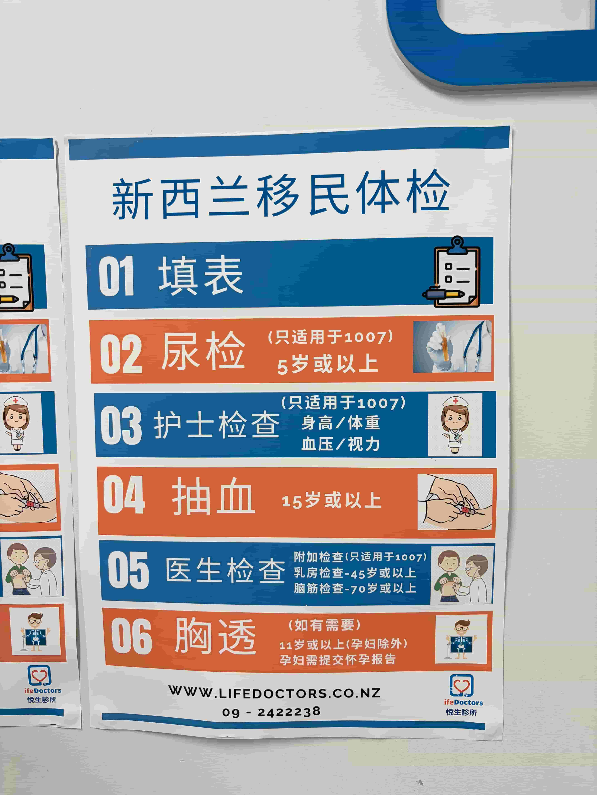
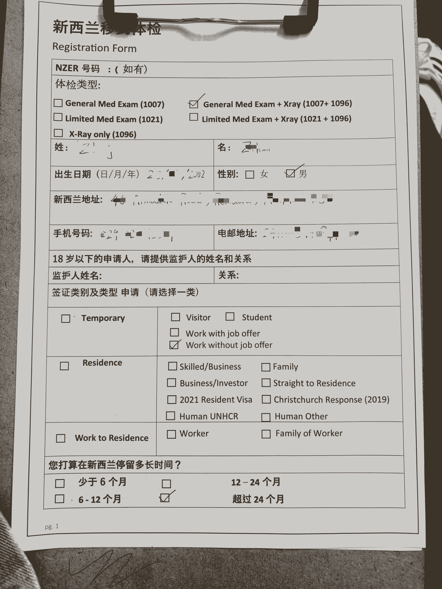
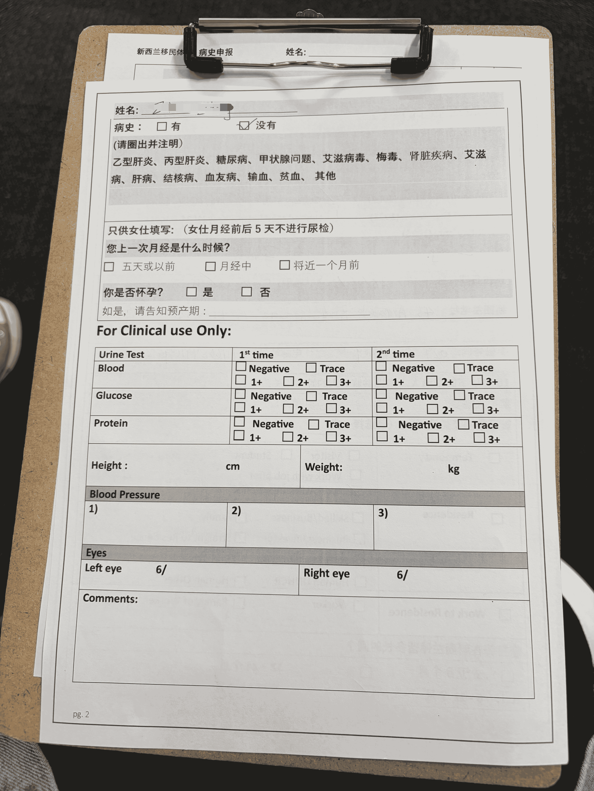
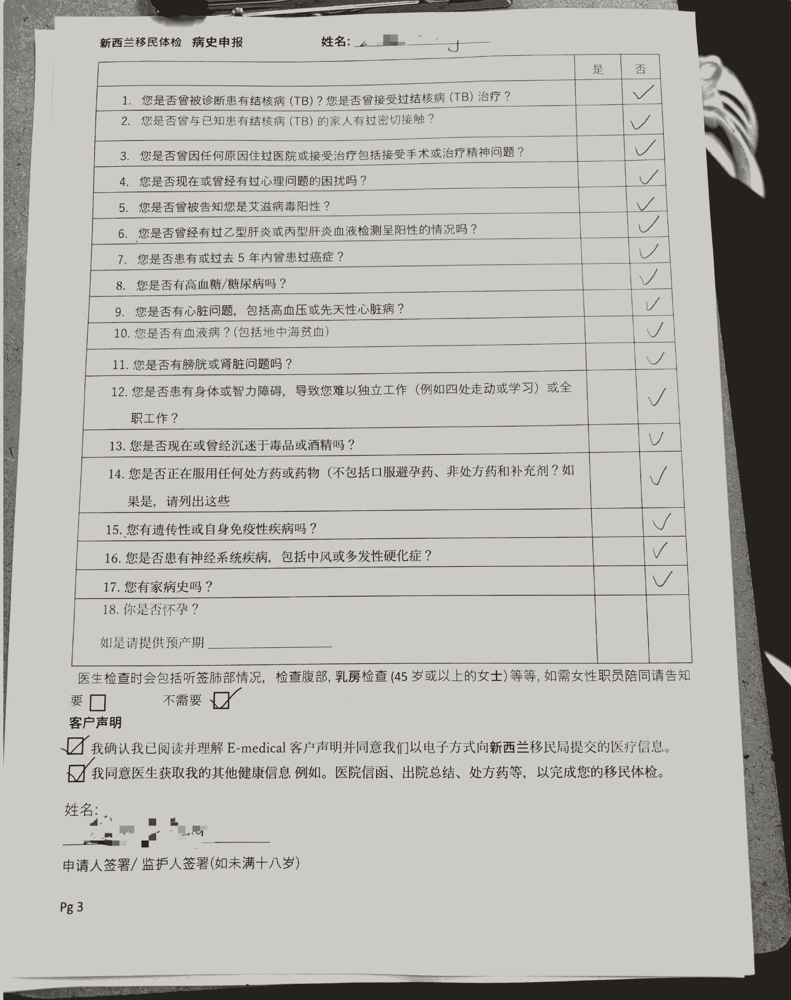
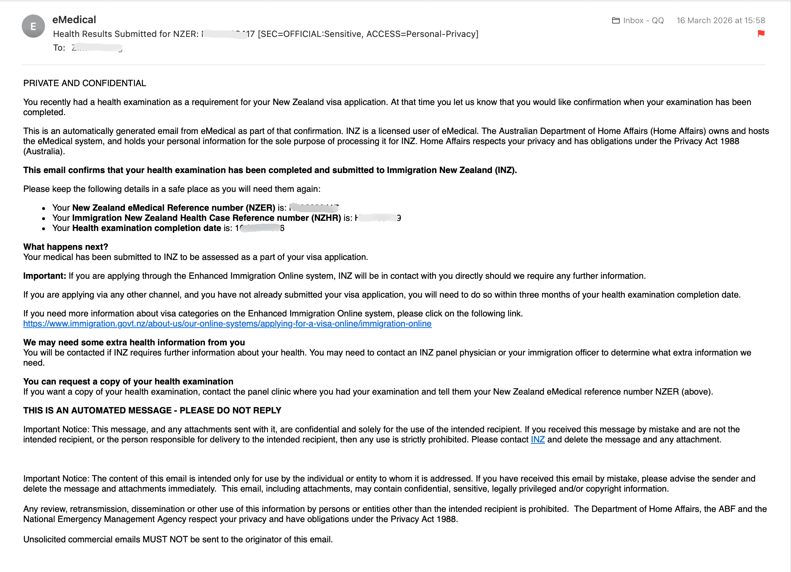

# Work Visa Medical Exam

To apply for a Post-study Work Visa (student visa to Open Work Visa), you must visit an Immigration New Zealand-designated **Panel Physician** for a medical exam. Results are sent directly to Immigration New Zealand through the **eMedical** system. Applicants cannot upload or modify them themselves.

::: tip
The medical exam must be completed at an Immigration New Zealand-**designated medical provider** (Panel Physician). The clinic uploads the report directly to the Immigration New Zealand system, and it cannot be withdrawn or modified.
:::

## Medical Exam Requirements

**Length of stay determines the medical exam items:**

| Length of stay | Medical exam items |
|----------------|--------------------|
| **More than 12 months** | Full medical exam (INZ 1007 form) + chest X-ray (INZ 1096 form) |
| **6-12 months** | Chest X-ray only (INZ 1096 form) |

Post-study Work Visas are usually valid for 1-3 years, so **most applicants need the full 1007 + 1096 medical exam**.

## What to Bring

- **Passport**: original
- **Water**: for the urine test
- **Money**: to pay the medical exam fee (cash/card; follow the clinic's rules)
- **Glasses**: if you wear them daily, you need them for the vision test

## Common Immigration Medical Clinics in Auckland

| Clinic | Address | Features | Price (for reference only) |
|--------|---------|----------|----------------------------|
| **Auckland City Doctors** | Queen Street, CBD | Very crowded, long waiting time | General Med Exam (1007) $240 |
| **Life Doctors Mt Eden** | Dominion Road | Fewer people, almost no queue, whole process takes a little over 1 hour | 1007 $280; 1007+1096 $380 |

::: tip
The author went to **Life Doctors Mt Eden**, so the process below uses this clinic as the example.
:::

- **Life Doctors website**: www.lifedoctors.co.nz
- **Phone**: 09-2422238

## Medical Exam Process (Life Doctors Mt Eden)

The full Life Doctors immigration medical exam process is as follows:

### Step 01: Fill in forms

In the waiting area, fill in the **Registration Form** for the New Zealand immigration medical exam. You need to complete:

- **NZER Number**: fill it in if known (the clinic can also add it later)
- **Exam type**: tick **General Med Exam + Xray (1007+1096)**
- **Personal information**: name, date of birth, New Zealand address, phone, email, gender
- **Visa category**: choose **Work without job offer** (corresponding to Open Work Visa)
- **Length of stay**: for a Post-study Work Visa, usually choose **more than 24 months**

**Medical history declaration** (page 2):

- Tick "Yes/No" for medical history
- Female applicants need to fill in menstrual and pregnancy information (urine tests are not done within 5 days before or after menstruation)
- Declare truthfully. Concealment may directly lead to visa refusal.

**Medical history questionnaire and declaration** (page 3):

- Answer 18 medical history questions one by one by ticking yes/no
- Tick the eMedical client declaration, agreeing to submit medical information electronically to Immigration New Zealand
- Authorize the doctor to obtain other health information to complete the medical exam
- Sign to confirm

### Step 02: Urine test

- Only applies to General Med Exam (1007)
- Required for applicants aged 5 and above
- Female applicants do not take a urine test within 5 days before or after menstruation
- **Drink water in advance** to make sample collection easier

### Step 03: Nurse checks

- Height and weight
- Blood pressure
- Vision (left eye and right eye; wear glasses if you use them)

### Step 04: Blood test

- Required for applicants aged 15 and above

### Step 05: Doctor examination

- Chest/lung auscultation and abdominal examination
- Females aged 45 and above: breast examination
- Applicants aged 70 and above: mental health check
- Female applicants can request a female medical staff member as a chaperone

### Step 06: Chest X-ray

- Required for applicants aged 11 and above, except pregnant applicants. Pregnant applicants need to submit a pregnancy test report.
- Applicants only completing the 1096 chest X-ray may skip some of the earlier steps, depending on the clinic's arrangement.

## After the Exam: eMedical Confirmation Email

After the medical exam, the clinic uploads the results to the eMedical system. Within a few days, you will receive a confirmation email from **eMedical** containing:

- Confirmation that **the medical exam has been completed and submitted to Immigration New Zealand**
- **NZER** (New Zealand eMedical Reference) number
- **NZHR** (Immigration New Zealand Health Case Reference) number
- **Medical exam completion date**

::: warning Submit the visa within 3 months
If you have not yet submitted your visa application, you must submit it **within 3 months from the date the medical exam was completed**.
:::

## Notes

- Medical exam results **cannot be withdrawn or modified**. Declare your medical history truthfully.
- Chronic conditions, such as hypertension or diabetes, usually do not affect the result if well controlled.
- If Immigration New Zealand requires further tests, they will contact the applicant directly.
- If you need a copy of the medical report, contact the medical clinic and provide your NZER number.

## Related Links

- [Post-study Work Visa overview](/en/visa/work-visas/post-study-work-visa/)
- [Immigration New Zealand Panel Physician list](https://www.immigration.govt.nz/new-zealand-visas/apply-for-a-visa/tools-and-information/medical-info/panel-physicians)
- [Life Doctors](https://www.lifedoctors.co.nz/)

---
*Last edited: 2026-03-23* · Author: [Bald-M](https://github.com/Bald-M)
