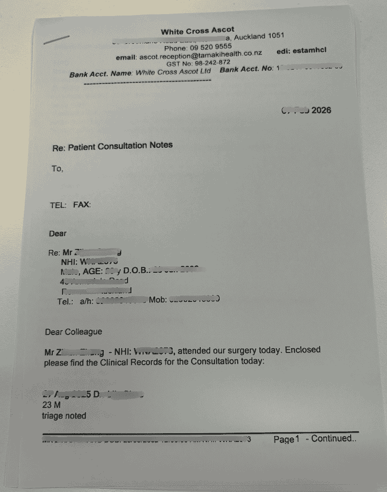

# White Cross 就医流程

White Cross 是新西兰常见的 **After Hours** 及 **Urgent Care** 连锁诊所，提供非工作时间的医疗服务和部分急诊服务。

::: tip
各 White Cross 门店地址、营业时间可能不同，建议出发前查看 [官网](https://www.whitecross.co.nz/) 或致电确认。
:::

## 适用场景

- 非工作时间（晚上、周末、节假日）身体不适
- 急但非危及生命的情况：发热、外伤、过敏、轻微骨折等
- 需尽快处理但不至于叫救护车的状况

## 就医流程

### 1. 查找附近门店

- 访问 [White Cross 官网](https://www.whitecross.co.nz/) 查找门店
- 或在地图软件搜索「White Cross」+ 所在城市

### 2. 前往诊所

- 大部分门店**可 walk-in**，无需提前预约
- 部分门店可能需电话确认是否开放、是否有空位

### 3. 登记与候诊

- 到达后在前台扫码登记
- 出示护照/驾照等证件
- 填写简要病情信息
- 等候叫号

### 4. 基础检查

- 等待护士叫号
- 配合护士做以下检查：
  - 测血糖
  - 尿检
  - 血压

### 5. 就诊与缴费

- 按叫号进入诊室，向医生说明症状
- 就诊结束后到前台缴费（现金/卡）

::: warning 报销必拿
**务必向前台索取以下材料**，以便后续报销：
- **Tax Invoice**（税务发票）
- **Consultation Note**（就诊记录）

缺一不可，否则可能无法报销。
:::

**Tax Invoice 示例：**

**Consultation Note 示例：**

### 6. 取药（如需要）

- 医生若开具处方，可到附近药房取药
- 部分 White Cross 门店旁或内有药房

## 费用与报销

- 费用通常高于普通 GP，具体以门店为准
- 持学生保险、旅游保险等可申请报销，参见 [看病报销](/medical-care/reimbursement/)

::: warning 报销必备
缴费后**务必向前台索取** **Tax Invoice**（税务发票）和 **Consultation Note**（就诊记录），二者为保险报销必需材料，离店后补办较麻烦。
:::

## 相关链接

- [White Cross 官网](https://www.whitecross.co.nz/)
- [看病报销](/medical-care/reimbursement/)

---
*最后编辑：待补充* · 作者：[Bald-M](https://github.com/Bald-M)
