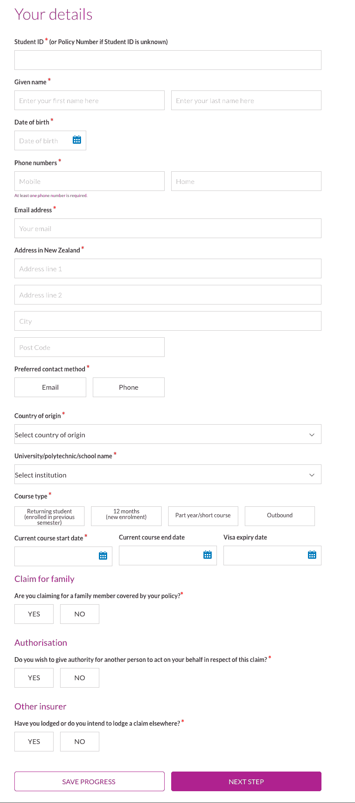
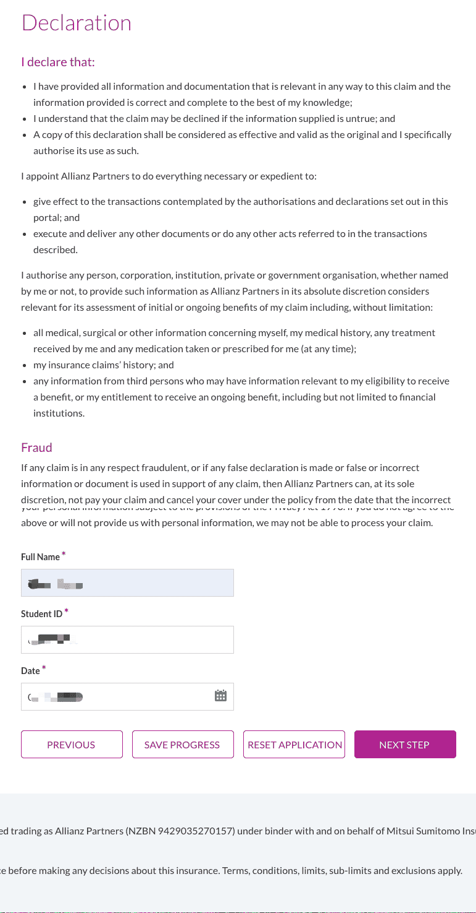
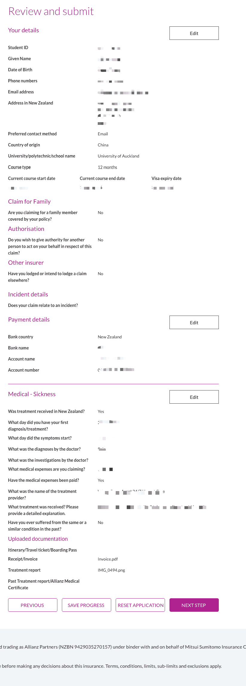

# 学生保险报销

持学生签证者通常由学校统一购买 **Student Insurance**（如 Studentsafe），覆盖 GP、部分专科、急诊等。本文以 [InsuranceSafe 在线理赔门户](https://www.insurancesafenz.com/claimsportal/) 为例，介绍学生保险的报销流程。

::: tip
不同学校合作的保险公司、保单细则各异。若学校使用 InsuranceSafe/Studentsafe，可参考本文；否则请在保险公司官网查看具体流程。
:::

## 报销前准备

### 所需材料

- **Tax Invoice / Receipt**（税务发票或收据）→ 对应门户中的 Receipt/Invoice
- **Consultation Note**（就诊记录 / 诊断说明）→ 对应门户中的 Treatment report
- 学生 ID 或保单号
- 新西兰银行账户信息（用于打款）

::: warning
部分诊所不会主动提供 Consultation Note，就诊时请主动向前台或医生索取。参见 [White Cross](/medical-care/emergency/white-cross/) 就医时务必索取的材料。
:::

### 支持的文件格式

- Word（.doc, .docx）、PDF、JPEG、PNG
- 文件名需为英文字符，单文件不超过 5MB

## Studentsafe 在线报销流程

适用于 [InsuranceSafe Studentsafe 门户](https://www.insurancesafenz.com/claimsportal/)（由 Allianz Partners 管理）。

### 1. 进入门户并开始新理赔

打开 [Studentsafe Online Claims Portal](https://www.insurancesafenz.com/claimsportal/)。

勾选底部的 **Terms and Conditions** 和 **Privacy Notice** 同意框，点击 **START A NEW CLAIM**。

### 2. 填写个人信息

按页面要求填写：

- 学生 ID（或保单号）、姓名、出生日期
- 手机/座机（至少填一项）、邮箱
- 新西兰地址
- 院校、课程类型、课程起止日期、签证到期日
- 是否为家人索赔、是否授权他人代为办理、是否在其他处已/将索赔

完成后点击 **NEXT STEP**。

### 3. 选择理赔类型

选择 **MEDICAL EXPENSE**（医疗费用）。

### 4. 选择医疗费用子类型

根据实际情况选择：

| 类型 | 说明 / 限额 |
|------|-------------|
| Sickness | 疾病相关医疗费用 |
| Injury | 意外受伤相关医疗费用 |
| Emergency dental | 急诊牙科（如急性牙痛），最高 $500 |
| Optical | 眼镜丢失/损坏或换镜片，每年最高 $200 |
| Alternative treatment | 正脊、针灸、足疗等替代疗法，最高 $500 |
| Mental illness | 心理健康相关，最高 $20,000 |
| Sexual Health | 性健康检查及治疗，最高 $215 |
| Other | 其他医疗费用 |

以普通看病为例，选择 **Sickness** 或 **Injury**，点击 **SELECT**。

### 5. 填写理赔详情并上传材料

填写诊断日期、症状开始日期、诊断内容、检查/治疗说明、医疗费用金额、是否已付款、就诊机构名称等。

在 **Please attach the required documentation** 中上传：

- **Receipt/Invoice**：Tax Invoice（税务发票）
- **Treatment report**：Consultation Note（就诊记录）

### 6. 声明与授权

阅读 **Declaration** 内容，勾选/确认信息真实无误，填写姓名、学生 ID、日期，然后点击 **NEXT STEP**。

### 7. 填写收款信息

提供新西兰银行账户信息，用于直接打款：

- 银行所在国家：选 New Zealand
- 银行名称、账户名称、账户号码

::: info
不支持打款至信用卡。若需保险公司直接付给医疗提供方，需先支付 applicable excess（免赔额）。
:::

### 8. 确认并提交

在 **Review and submit** 页核对你填写的信息和上传的文件，有误可点击 Edit 修改。确认无误后点击 **NEXT STEP** 提交。

### 9. 提交成功

提交后会显示确认页，提示将开始处理并通过你选择的联系方式与你联系。

### 10. 理赔到账

审核通过后，会收到邮件通知，款项将直接打入你提供的银行账户，通常 3 个工作日内到账。

## 预批（Pre-approval）

若在就诊前希望先获得预批，可：

1. 下载 [Studentsafe 理赔表](https://www.insurancesafenz.com/claimsportal/pdfs/Studentsafe_Claim_Form.pdf)
2. 准备：
   - GP/专科医生的 Consultation Note（症状、诊断、建议检查/治疗）
   - 治疗机构的书面报价
3. 发邮件至 [studentsafeclaims@allianz-assistance.co.nz](mailto:studentsafeclaims@allianz-assistance.co.nz)，主题注明 **Pre-approval**

## 保存进度

填写过程中可点击 **SAVE PROGRESS**，之后用邮箱和系统发送的 PIN 码继续填写。

## 联系方式

- 电话：0800 486 004 或 +64 9 488 4638
- 邮箱：studentsafeclaims@allianz-assistance.co.nz
- 工作时间：周一至周五 8:30–17:00（新西兰时间，节假日除外）

## 常见问题

### 哪些机构可以报销？

就诊前可致电 0800 486 004 确认该诊所/医院是否在认可名单内。GP、White Cross 等常用机构通常可报。

### 报销周期多久？

一般 1～4 周，审核通过后约 3 个工作日到账。

### Workersafe / Explorersafe 保单

若你持 Workersafe 或 Explorersafe 保单，请使用 [另一理赔门户](https://www.claimmanager.co.nz/)，不要使用 Studentsafe 门户。

## 相关链接

- [看病报销](/medical-care/reimbursement/)：报销总览
- [White Cross](/medical-care/emergency/white-cross/)：急诊就医时记得向前台索取 Tax Invoice 和 Consultation Note
- [Studentsafe 理赔门户](https://www.insurancesafenz.com/claimsportal/)
- [奥大学生医疗保险报销全流程｜实测可退💰 在新西兰看...](http://xhslink.com/o/2hB2JlrR0Qf)（小红书）

---
*最后编辑：2026-01-10*
