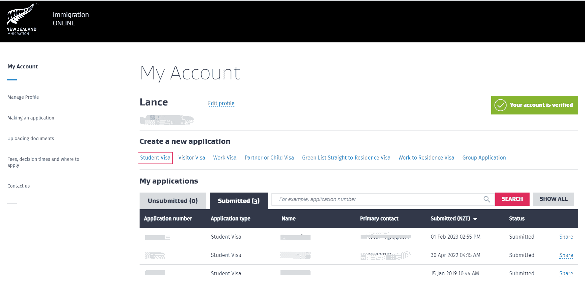
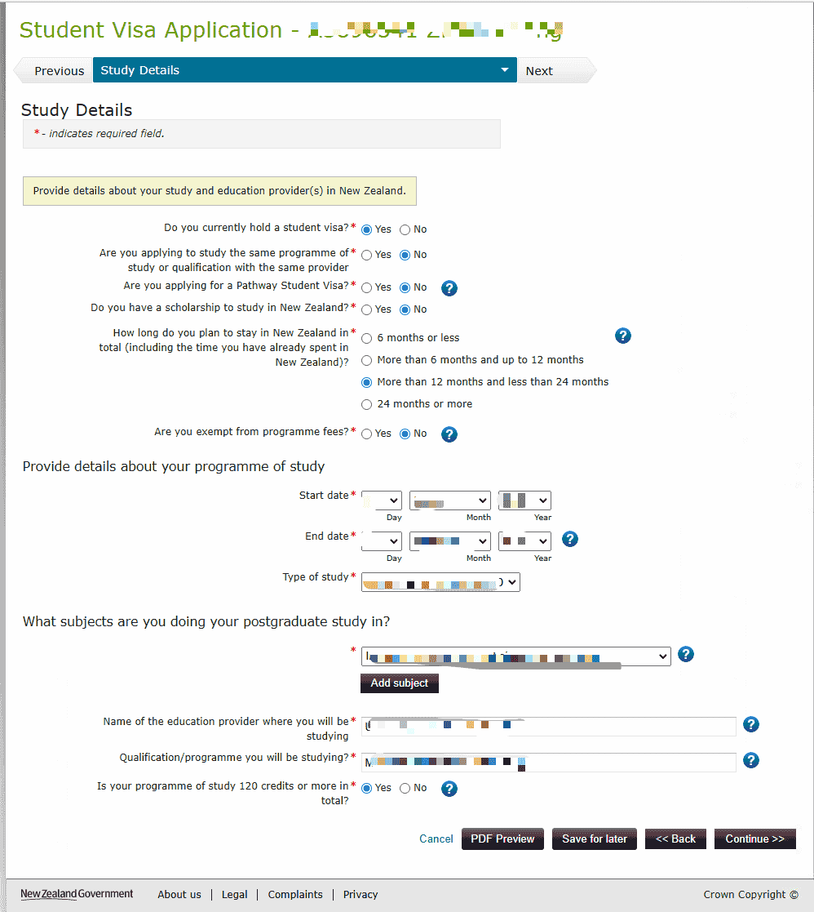
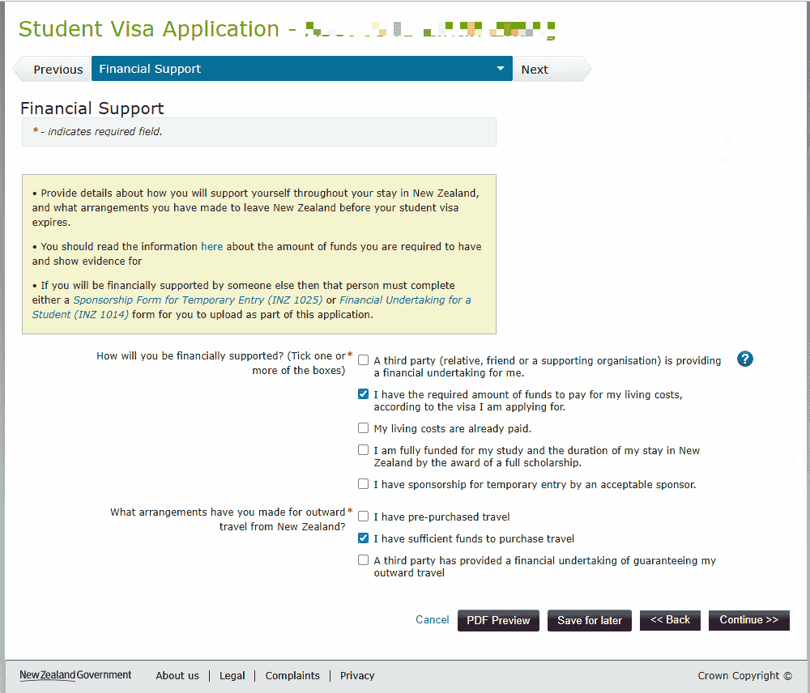
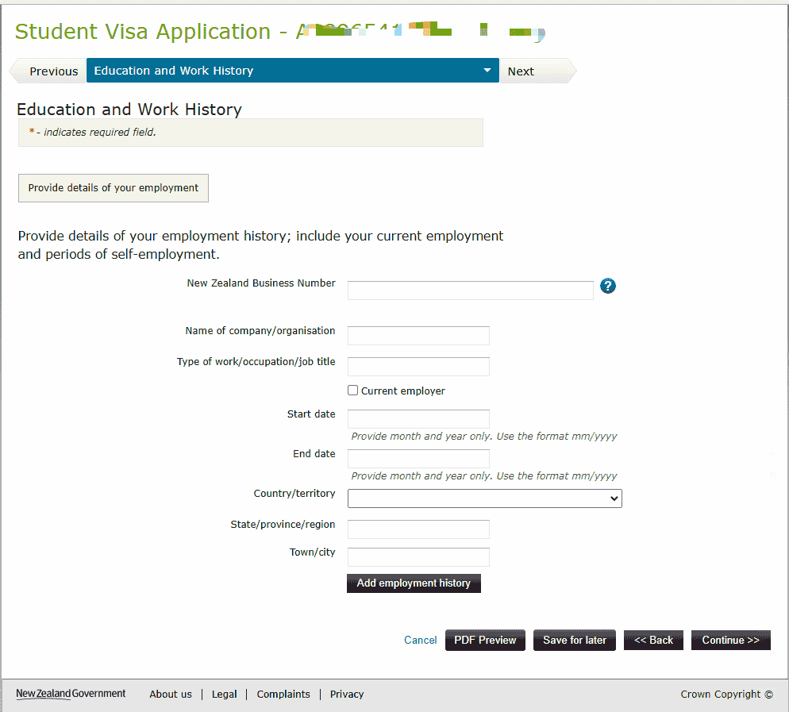
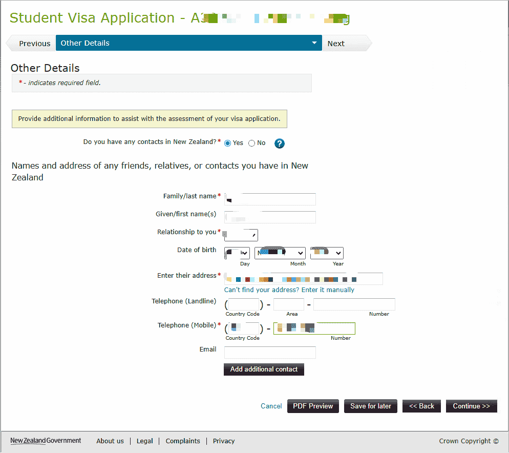
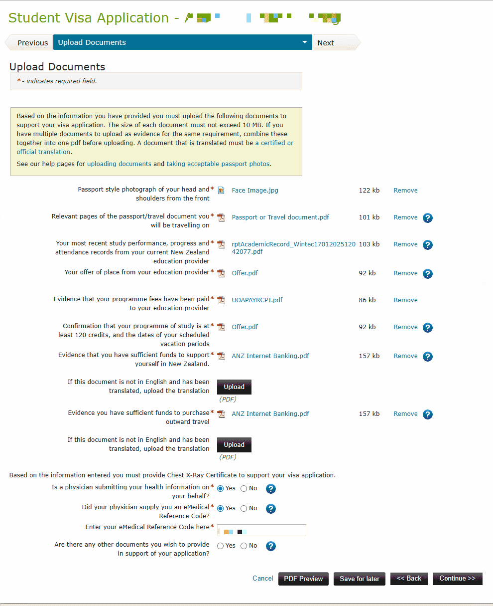
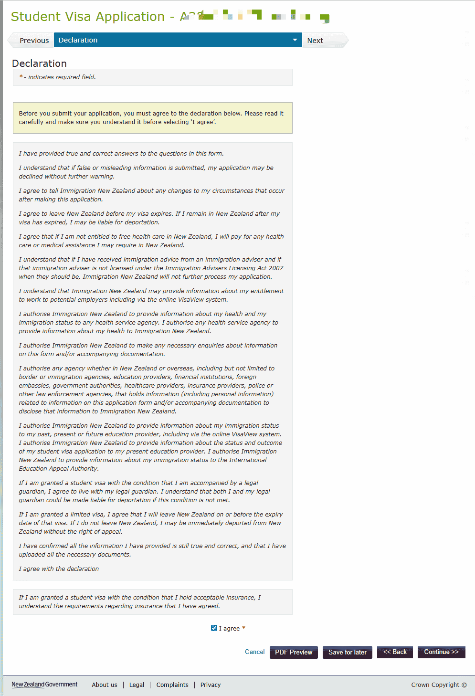
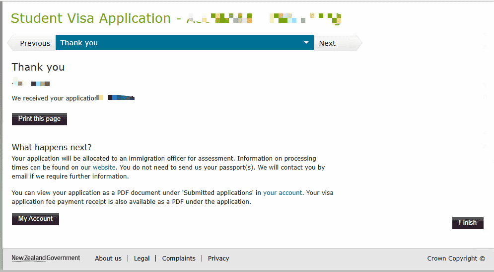

# 学生签证（Student Visa）

申请新西兰学生签证需通过新西兰移民局官网在线提交，使用 RealMe 账号登录。

::: tip
以下信息基于 2025 年 1 月流程整理，具体请以移民局官网最新要求为准。
:::

## 材料准备

| 材料 | 说明 |
|------|------|
| **护照主页照片** | 个人信息页清晰扫描件 |
| **Offer** | 新西兰院校录取通知书 |
| **成绩单** | 必须是官方 **Academic Transcript** |
| **学费支付证明** | 已缴纳学费的凭证 |
| **存款证明** | 足够在新西兰生活的金额（银行流水），参见 [银行流水](/bank-statement/) |
| **Visa 卡** | 用于支付签证费等 |
| **出境旅行证据** | 如机票等 |
| **eMedical Reference Code** | eMedical 号码在完成胸片体检后几个工作日内，由发件人「eMedical」发送至邮箱 |

## 关于胸片体检

- **有效期**：胸片有效期为 **36 个月**
- **免检情形**：若非首次申请，且上次胸片尚未过期，则无需重新拍摄
- 详见 [出国体检 - 胸片](/pre-departure-medical/)

## 申请流程

### 1. 进入新西兰移民局签证页面

访问 [immigration.govt.nz](https://www.immigration.govt.nz/)，进入「New Zealand visas」页面，可选择「Explore and select a visa」或使用搜索框查找「Student visa」。

### 2. 选择学生签证并登录

在「Log into our online systems」页面中，找到 **Student visa** 选项，点击进入。在下方「Student visa」区块点击红色 **Log in** 按钮。若无账号，可在此处创建。

### 3. 使用 RealMe 登录

- **已有 RealMe 账号**：输入用户名和密码，点击 **Log in** 登录
- **无账号**：点击右侧「Create a RealMe login」注册 RealMe 账号

### 4. 创建新的学生签证申请

登录后进入 My account，在下方 Create a new application 下点击 Student Visa

### 5. 在线填写并提交

登录后按引导完成申请表，上传材料，支付签证费并提交。

 

 

 

 

 

 

 

 

 

 

## 注意事项

- eMedical 号码需在邮箱中搜索发件人「eMedical」获取，体检完成后约几个工作日收到
- 成绩单必须为学校出具的官方 Academic Transcript，非普通成绩单
- QQ 邮箱可能拦截移民局邮件，如果没收到邮件请在垃圾箱查找

---
*最后编辑：2025-01-23* · 作者：[Bald-M](https://github.com/Bald-M)
