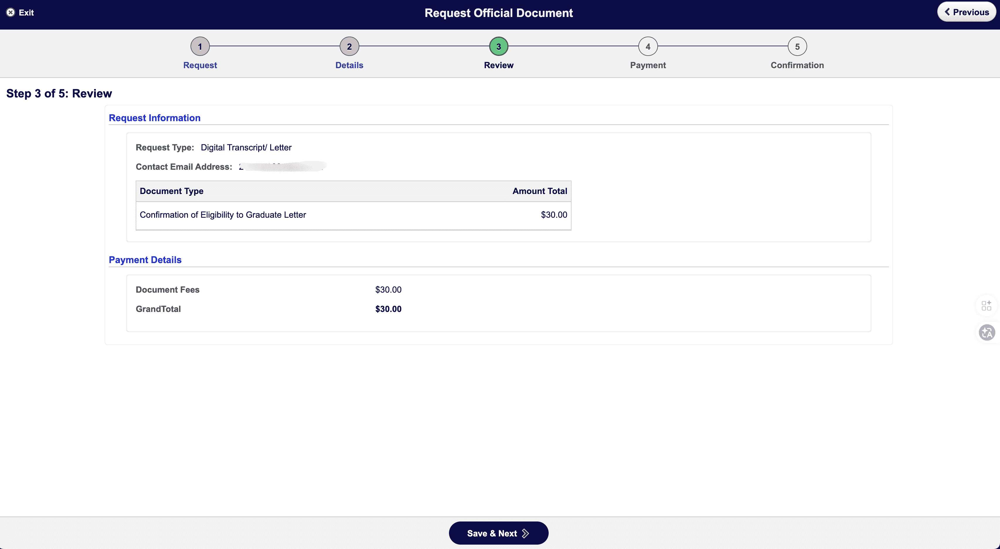
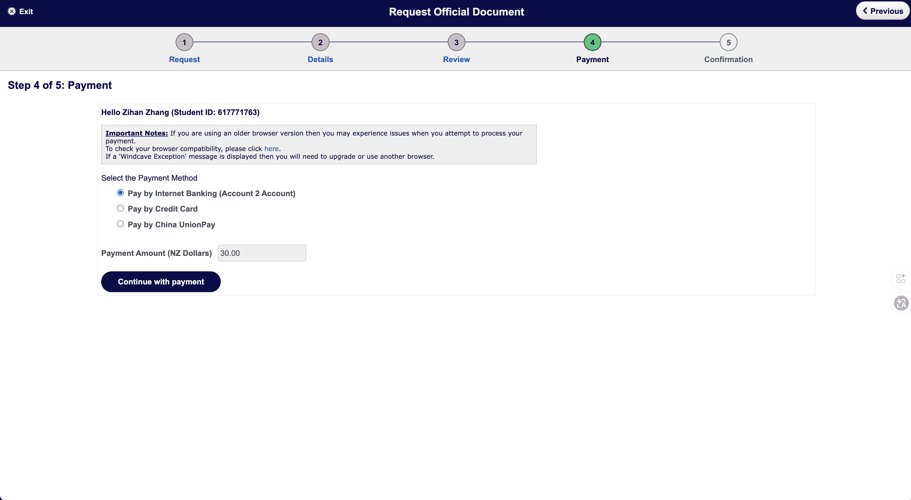
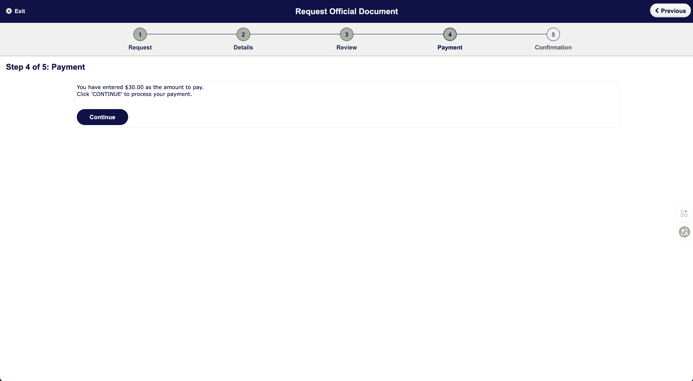

# Completion Letter

Completion Letter（课程完成证明）是申请毕业后工签的重要材料。在奥克兰大学（University of Auckland），该证明的正式名称为 **Confirmation of Eligibility to Graduate Letter**，需通过学生门户在线申请。

::: tip
本文以**奥克兰大学**为例说明，其他院校流程可能不同，请以各自学校官网为准。
:::

## 申请前准备

- 学生账号（可登录 Student Homepage）
- 系统状态已更新为 **eligible to graduate**（符合毕业资格）
- 建议先查看 [unofficial transcript](https://www.auckland.ac.nz/) 确认成绩、课程信息无误

::: warning
此信仅可发给**当前符合毕业资格、但尚未正式毕业**的学生。若系统未显示「eligible to graduate」，需先联系学校更新状态。
:::

## 费用与办理时间

| 项目 | 说明 |
|------|------|
| 费用 | $30 NZD |
| 处理时间 | 一般 5～7 个工作日 |
| 特殊情况 | 1981 年以前或原 Auckland College of Education 的记录，可能需约 10 个工作日 |

## 申请流程（奥克兰大学）

### Step 1：进入 Request Official Document

登录 [SSO](https://www.auckland.ac.nz/en/students/my-tools/sso.html)，在首页找到 **Request Official Document** 并点击进入。

### Step 2：Request（请求信息）

1. **Request Type**：选择 **Digital Transcript/ Letter**
2. 确认数字文件将通过 **My eQuals** 发送至学生邮箱
3. 勾选：
   - 「I have checked my unofficial transcript and it contains all information I am expecting to see.」
   - 「I have checked My eQuals and it does not contain the document I require.」
4. 点击 **Save & Next**

::: tip
申请前请先在 [My eQuals](https://www.myequals.net/) 确认是否已有该证明，避免重复申请。
:::

### Step 3：Details（选择文档类型）

1. **Document Type**：选择 **Confirmation of Eligibility to Graduate Letter**
2. 确认费用为 **$30.00**
3. 该证明内容包括：
   - 符合毕业资格的日期
   - 学历/学位名称
   - 主修/专业方向
   - 最近一次毕业典礼日期
4. 不含课程和成绩（课程与成绩在 Transcript 中）
5. 点击 **Save & Next**

### Step 4：Review（核对）

核对申请类型、文档类型及金额（$30），确认无误后点击 **Save & Next**。

### Step 5：Payment（支付）

1. 选择支付方式：
   - **Pay by Internet Banking (Account 2 Account)**
   - **Pay by Credit Card**
   - **Pay by China UnionPay**
2. 支付金额：**$30.00**
3. 点击 **Continue with payment** 进入支付页面

4. 确认金额为 $30.00，点击 **Continue** 完成支付

::: warning
若出现 **Windcave Exception** 提示，多为浏览器版本过旧，建议升级或更换浏览器后再试。
:::

### Step 6：Confirmation（确认）

支付成功后，页面会显示「Thank you for your order and payment」。处理开始后，将向您填写的邮箱发送确认邮件，数字文件将通过 **My eQuals** 发送至学生邮箱。

## 领取方式

1. **收邮件**：处理完成后会收到 My eQuals 的邮件通知
2. **登录下载**：前往 [My eQuals](https://www.myequals.net/) 登录（使用奥克兰大学账号），在 **Documents** 页找到 **Confirmation of Graduation**（或 Confirmation of Eligibility to Graduate Letter），状态为 **Available** 时点击下载 PDF
3. **签证使用**：移民局申请时可上传该 PDF 作为 Completion Letter

## 注意事项

- 建议在**成绩全部确认、学位状态已更新为 eligible to graduate** 后再申请
- 申请前先确认 My eQuals 中尚未包含该证明，避免重复付费
- 数字证明一般无明确有效期，建议在递交签证前 3 个月内取得

## 相关链接

- [毕业后工签总览](/visa/work-visas/post-study-work-visa/)
- [移民局在线申请流程](/visa/work-visas/post-study-work-visa/immigration-application/)
- [奥克兰大学 Student Homepage](https://www.auckland.ac.nz/)
- [My eQuals](https://www.myequals.net/)

---
*最后编辑：2026-03-23* · 作者：[Bald-M](https://github.com/Bald-M)
