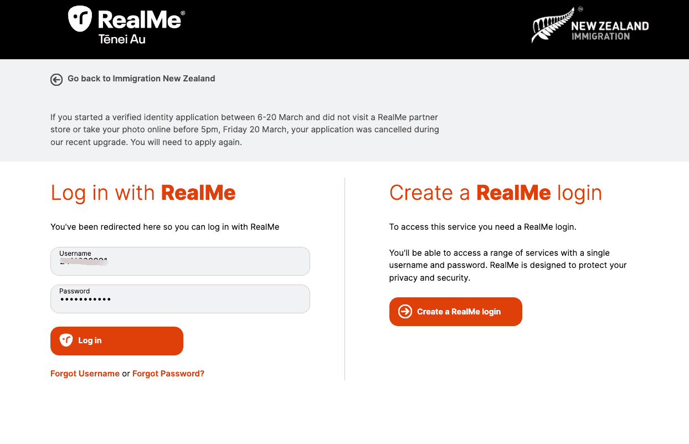
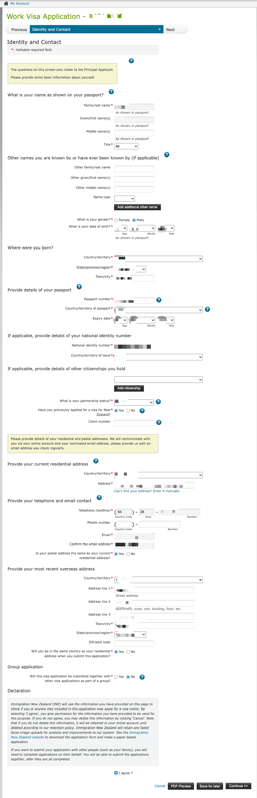
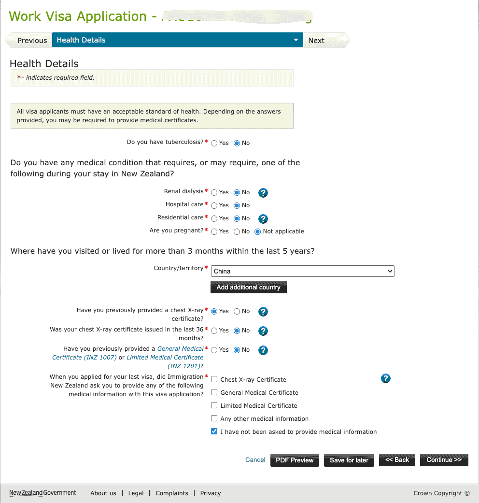
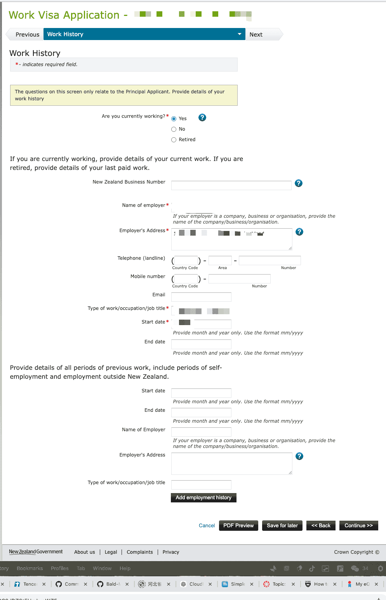
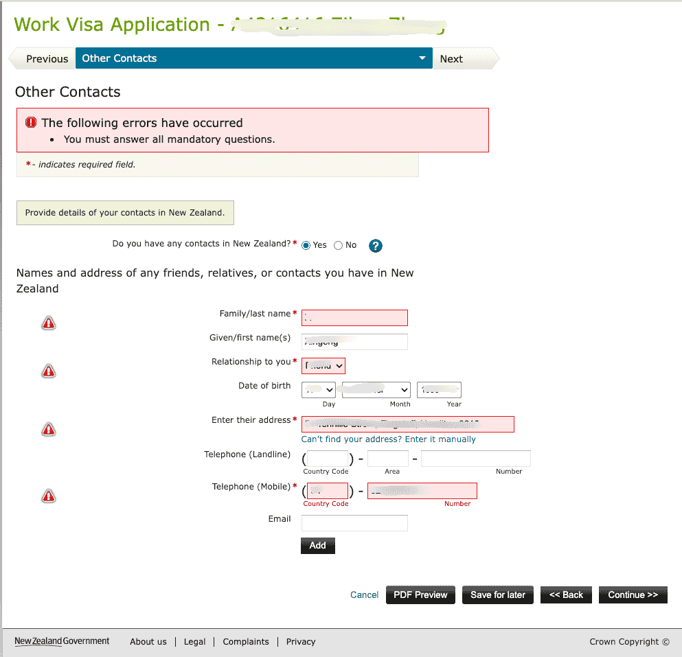
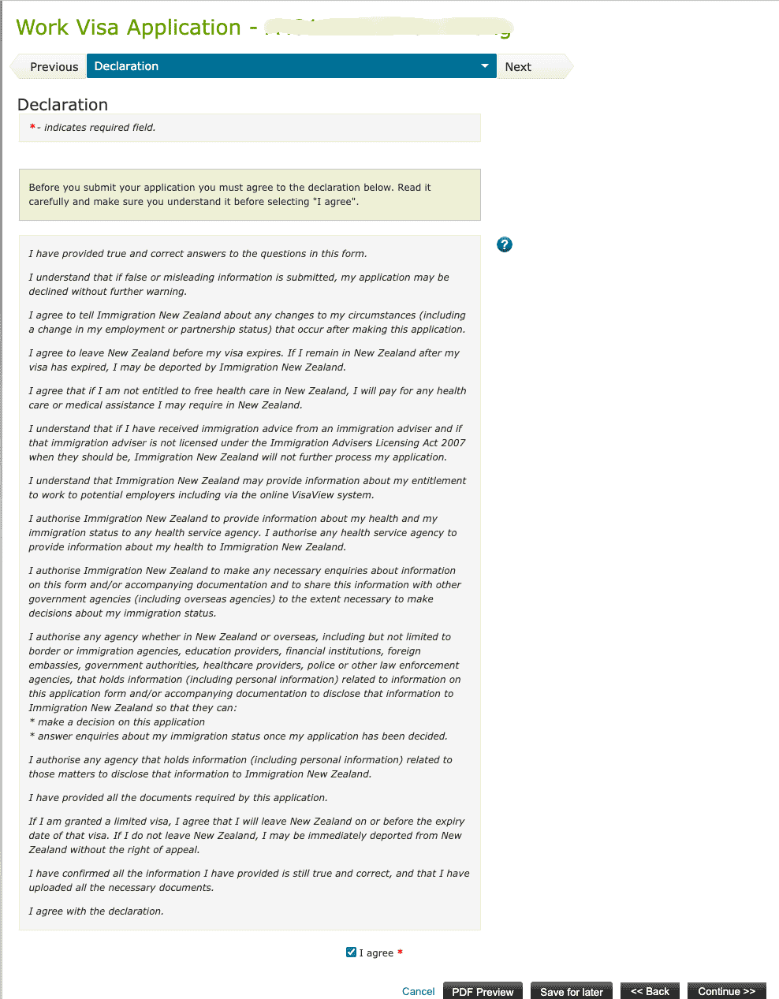

# 移民局在线申请流程

申请毕业后工签需通过新西兰移民局官网在线提交。本文介绍从登录到提交的详细操作流程。

::: tip
申请前请确保已完成 [体检](/visa/work-visas/post-study-work-visa/medical-examination/) 并取得 [Completion Letter](/visa/work-visas/post-study-work-visa/completion-letter/)。
:::

## 申请前准备

| 材料 | 说明 |
|------|------|
| RealMe 账号 | 若已有学签申请经历，通常已有；否则需注册 |
| 护照 | 个人信息页扫描件（PDF） |
| Completion Letter | 从 My eQuals 下载的课程完成证明（PDF） |
| 成绩单 | Academic Transcript（PDF） |
| 体检 eMedical | NZHR 号码，体检已完成并上传 |
| 无犯罪证明 | 若需提供，参见 [无犯罪记录证明](/criminal-record/) |
| 资金证明 | 银行流水等，证明有足够资金支持在新西兰生活 |
| Visa / MasterCard / 银联卡 | 支付签证费 |

## 申请流程

### Step 1：进入工签登录页

访问 [immigration.govt.nz](https://www.immigration.govt.nz/)，在「Log into our online systems」页面：

1. **What would you like to do?** 选择 **Start, edit or check the status of an application**
2. **Choose a visa or application type** 选择 **Work visas**
3. 点击 **Log in**（使用 RealMe）

### Step 2：RealMe 登录

- 已有账号：输入用户名和密码，点击 **Log in**
- 无账号：点击 **Create a RealMe login** 按提示注册

### Step 3：创建新申请

登录后进入 **My Account**，在 **Create a new application** 下点击 **Work Visa**。

### Step 4：确认表格适用性

在 **Is this form right for you?** 页面回答筛查问题：

1. **Are you applying for one of these types of work visas?** 选 **Yes**，并确认为 **Post-Study Work Visa** 等类型之一
2. **Do you have a MasterCard, Visa or UnionPay card to pay?** 选 **Yes or I am from a fee waiver country**
3. **Are you an Australian citizen or permanent resident?** 选 **No**

::: warning
**不要**用此表格申请 Accredited Employer Work Visa。若雇主已提供工作 offer，会收到专属申请链接。
:::

点击 **Start My Application >>** 开始填写。

### Step 5：Identity and Contact（身份与联系方式）

填写个人信息、护照信息、居住地址、邮箱、电话等。勾选隐私声明后点击 **Continue >>**。

### Step 6：Work Details（工作详情）

- **What type of work visa are you applying for?** 选 **Post-Study Work Visa**
- **Do you have a job offer that requires New Zealand Registration?** 选 **I don't have a job offer**
- **How long do you plan to stay in New Zealand in total?** 选 **24 months or more**
- **Did you hold, or had you applied for, your student visa on or before 11 May 2022?** 按实际情况选择（通常选 **Yes**）

### Step 7：Health Details（健康信息）

- 结核病、特殊医疗需求、怀孕等：按实际情况选择
- **Where have you visited or lived for more than 3 months within the last 5 years?** 添加居住超过 3 个月的国家（如 China）
- **Chest X-ray / General Medical Certificate**：若已做体检，按实际情况选择；胸片 36 个月内有效
- 若移民局曾要求提供体检材料，按提示填写

### Step 8：Character Details（品行信息）

回答关于犯罪记录、驱逐、拒签、无犯罪证明等问题。若计划停留 **24 个月及以上**，可能需提供**无犯罪证明**。

- 若曾提供过中国无犯罪证明，需说明是否在 **24 个月内**出具
- 详见移民局 [Police certificate](https://www.immigration.govt.nz/) 说明

### Step 9：Work History（工作经历）

填写当前及过往工作经历，包括雇主名称、地址、职位、起止日期等。

### Step 10：Qualification History（学历信息）

填写学历信息：起止日期（mm/yyyy）、院校名称、学历名称。对应 Post-Study Work Visa 所需的 Completion Letter 及成绩单。

### Step 11：Other Contacts（在新西兰的联系人）

如有在新西兰的亲友或联系人，选 **Yes** 并填写其姓名、关系、地址、电话等。若无，选 **No**。

::: tip
若选 **Yes**，需填写所有带 * 的必填项，否则会提示「You must answer all mandatory questions」。
:::

### Step 12：Apply on Behalf / Assist（代办与协助）

- **Are you completing this form on behalf of someone else?** 自己申请选 **No**
- **Have you received immigration advice or assistance?** 按实际情况选择

### Step 13：Upload Documents（上传材料）

按材料清单上传，**单文件不超过 10 MB**。多页材料需合并为一个 PDF 后上传。

| 材料 | 格式 | 说明 |
|------|------|------|
| 证件照 | JPEG | 符合移民局要求的护照规格照片 |
| 护照 | PDF | 个人信息页 |
| Evidence of qualifications | PDF | Completion Letter、成绩单 |
| Evidence of sufficient funds | PDF | 银行流水等资金证明；非英文需附 certified 翻译 |
| Medical information | eMedical | 填写 NZHR 号码，体检由诊所直接上传 |
| Police certificate | PDF | 若要求提供（如中国无犯罪证明） |

### Step 14：Declaration（声明）

阅读声明内容，确认信息真实、授权移民局核实（包括向金融机构查询等），勾选 **I agree** 后点击 **Continue >>**。后续完成支付即完成提交。

## 申请后

- 登录移民局系统可查看申请状态
- 审理时间因个案而异，通常数周至数月
- 如需补充材料，移民局会通过邮件或系统消息通知

## 相关链接

- [毕业后工签总览](/visa/work-visas/post-study-work-visa/)
- [体检](/visa/work-visas/post-study-work-visa/medical-examination/)
- [Completion Letter](/visa/work-visas/post-study-work-visa/completion-letter/)
- [新西兰移民局](https://www.immigration.govt.nz/)
- [无犯罪记录证明](/criminal-record/)
- [银行流水](/bank-statement/)

---
*最后编辑：2026-03-23* · 作者：[Bald-M](https://github.com/Bald-M)
